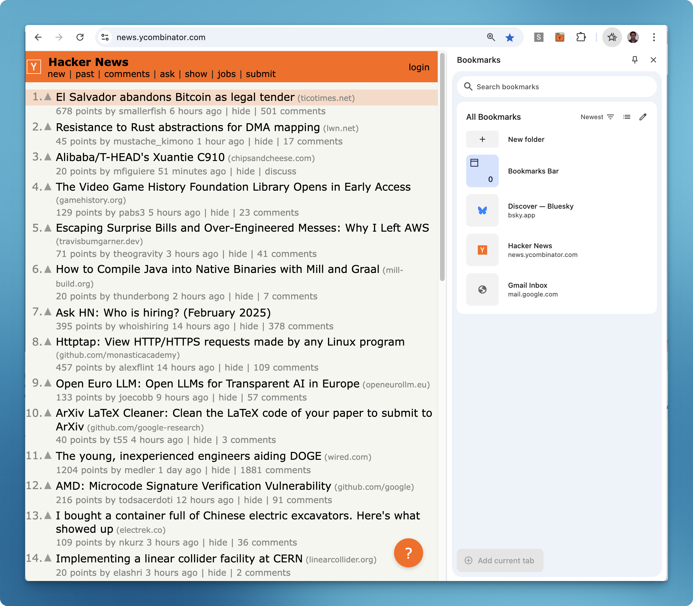
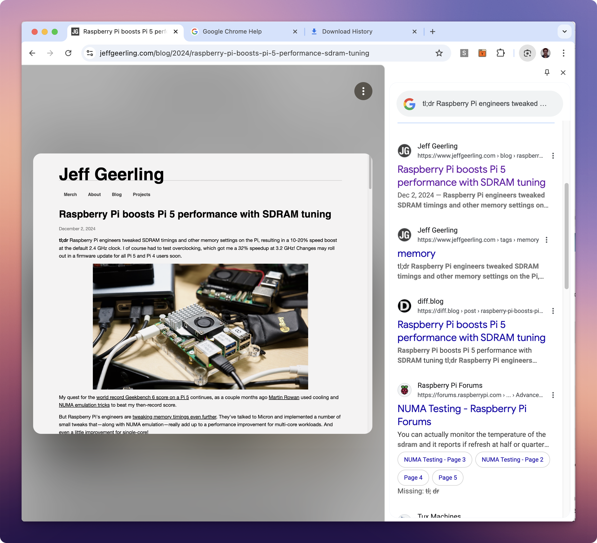
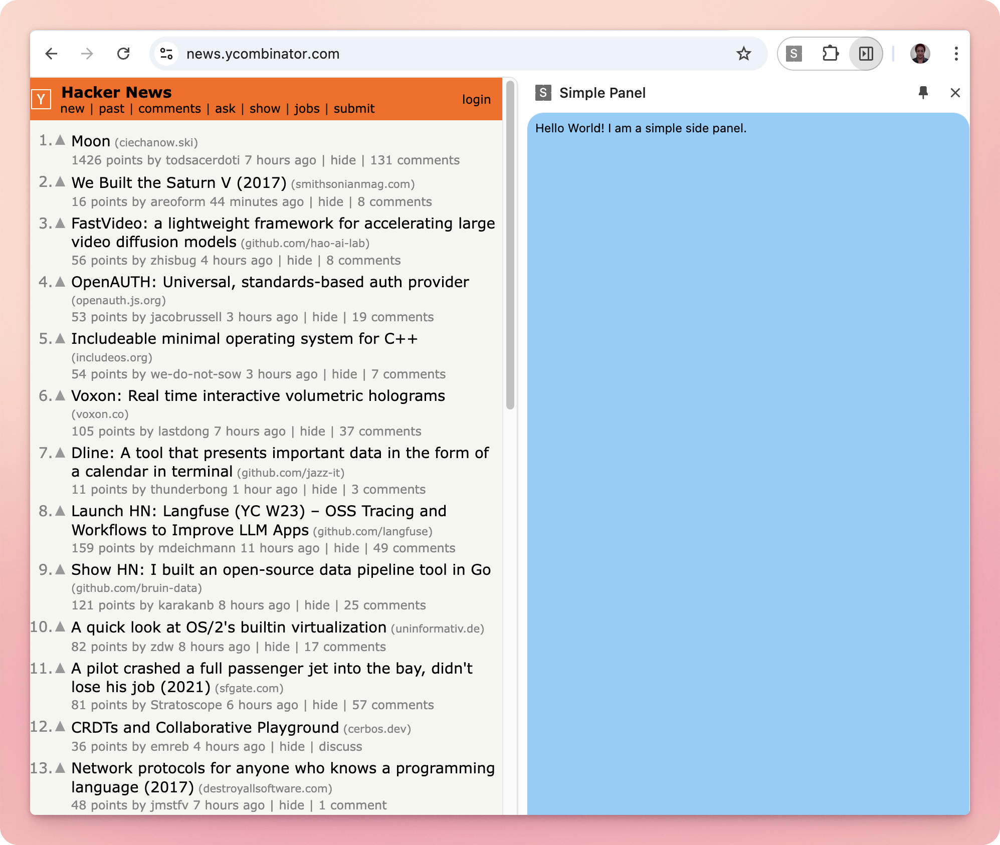
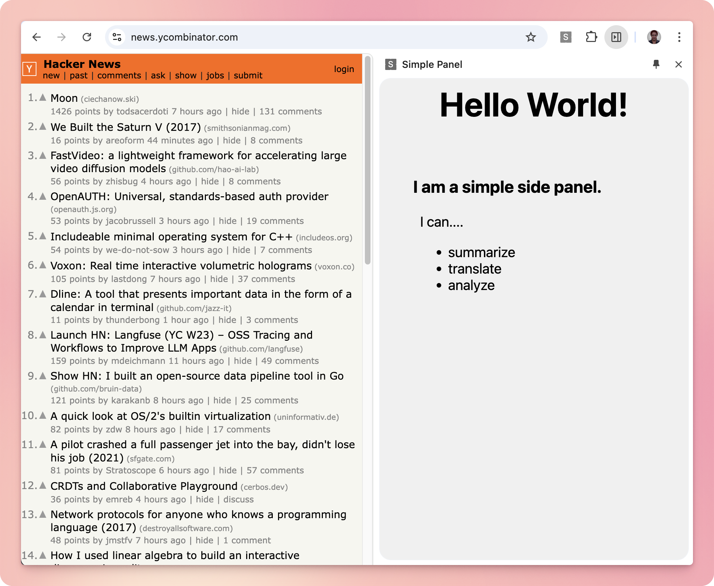

+++
title = "Chrome Side Panel"
description = "The easiest way to build a user interface for browser extensions"
date = "2024-12-15T12:15:21-07:00"
draft = false
tags = ["modern-web-dev", "web-development", "tech-explorations", "how-to", "building"]
topics = ["browser-extensions"]
+++

Of late, I have been building and [learning about browser extensions](/post/browser-extn-intro/) for a few projects. It was surprising to learn that there are many ways to build UI for these extensions and the most interesting one was the Side Panel UI available to Chrome extensions. In this post, I will talk about the Chrome side panel, how to build one and the advantages and limitations of using it.

## The Chrome side panel
It is a vertical panel that opens on either side of the browser window, providing quick access to your bookmarks, history, reading list, and Google Lens. It has a consistent layout and behavior across all websites. It was first introduced in Chrome in May 2023. 

This side panel gives quick access to various browsing activities:
* **Bookmarks** - access your bookmarks with more (vertical space) to search and find, compared to the horizontal tab bar
* **History** - view your browsing history in grouped format
* **Reading List** - maintain a list of pages that you want to read later or keep for reference.

Here is the **Bookmarks** side panel that shows all my bookmarks on the right side of the browser window.


And this is the same side panel, this time showing the **Google Lens** feature.


Here are a few additional use cases for side panel - [Side panel use cases](https://developer.chrome.com/docs/extensions/reference/api/sidePanel).

## How to open the side panel
You can open the side panel by clicking on the three vertical dots on the top right corner of the browser toolbar. Then choose the menu options in the second column in this table so that you can select the panel you want to open.



This panel remains open as you navigate between tabs and websites. This allows for a continuous workflow without the need to constantly reopen or switch between different tools.

### Pinning a side panel
If you frequently use any specific content in the side panel, for example, Bookmarks, you can pin that panel and access it quickly whenever you need it. Here is how you do it:
* Open the **Bookmarks** panel as described above.
* Click the '**pin**' icon on the toolbar. This will make the bookmark icon appear on the toolbar. 
* Then if you open any other panel (History/ Reading List), you can click on the bookmark icon and it will take you back to the Bookmarks panel.

Any website you visit, the Bookmarks side panel will be there. If you don't want to see it, you can close it by clicking the 'x' button on the panel.

## Side panel and browser extensions
Ok, all of this is great. But how is this side panel relevant for browser extensions? Well, a browser extension can put any custom content in the side panel in a few simple steps. This could be a simple panel to summarize the content of the page, or translate the content to another language, or show a list of related articles. The possibilities are endless!

The best part is that the browser takes care of all the interactions in the panel - open, close, pin, scrollbar etc. Unlike the regular 'popup' UI of browser extensions, this side panel gives a lot more real estate to work with. So for example, you can summarize the whole content of the currently open web page and show it in the side panel. 

It is super easy and fun  to build a side panel. The API is straight-forward. But there are a few nuances of how to communicate with the rest of the extension, which we will learn here.

## How to create your own side panel
In order to create a side panel, you create a Chrome extension with the permissions to show the side panel and add the html/css/js files to render your content. Let's go through the steps one by one.

1. Create a new extension 
    * If this is your first time creating an extension, see detailed description in my previous post [How to create a Chrome extension](/post/browser-extn-intro#the-how).
2. Create an HTML file **sidepanel.html** and add any HTML content to it. 
3. Update the manifest file **manifest.json** to add **sidePanel** to the **permissions** array. See details about the [manifest file](https://developer.chrome.com/docs/extensions/reference/manifest):
4. Load the extension in the browser using the 'Load unpacked' option in the [local Chrome extensions](chrome://extensions/) page.

You can see a real example of this in my github repo [hello-chrome-side-panel](https://github.com/annjose/hello-chrome-side-panel). You can clone the repo and load the extension in your browser.

Or if you are in for a quick start, here is how the files would look like:

The manifest file - **manifest.json**:
``` json manifest.json file
{
  "manifest_version": 3,
  "name": "Simple Panel",
  "version": "1.0",
  "description": "A simple Chrome extension that adds a side panel to the browser.",
  
  "permissions": [
    "sidePanel"
  ],
  "side_panel": {
    "default_path": "sidepanel.html"
  }
}
```

The HTML file **sidepanel.html**:
``` html
<html>
<body>
    Hello World! I am a simple side panel.
</body>
</html>
```

With the above changes, you can see your content in the side panel. In the browser toolbar, you will see a new icon for your extension. Click on it and select 'Open side panel' and it will open the side panel with your content. The name of your extension specified in the manifest file will be displayed on the top of the panel. You can close the panel by clicking the 'x' button on the panel.

Here is a screenshot of how your side panel will look like:



Once you have the basics, you can add CSS for the styles and JS files to add interactivity to your content. You would do this like a regular web page.
Your modified html sidepanel.html file:
``` html
<html>
    <head>
        <title>Side panel</title>
        <meta charset="UTF-8" />
        <link rel="stylesheet" type="text/css" href="styles.css" />
        <script src="scripts.js"></script>
    </head>
    <body>
        <h1>Hello World! </h1>
        <main>
            <h3>I am a simple side panel.</h3>
            <div>I can....
            <ul>
                <li>summarize</li>
                <li>translate</li>
                <li>analyze</li>
            </ul>
            </div>
        </main>
    </body>
</html>
```

Your styles are in the CSS file styles.css:
```css
body {
    background-color: #f0f0f0;
}

main {
    margin: 20px;
    padding: 20px;
}

h1{
    font-size: 48px;
    text-align: center;
}
h3 {
    font-size: 24px;
}
div {
    font-size: 20px;
    margin: 10px;
}
```

And you script are in the sidepanel.js
```js
console.log('the script file for sidepanel');
```

Now your side panel will look like this:


As you can see, the content is styled and has a script file attached to it. You can add more interactivity to your content by adding more JS code. This is why I find the side panel UI very interesting - it is customizable, extensible and easy to build.

## Differences between popup and side panel
- Side panel give you access to the functionality (eg: bookmarks or Google Lens) in any page and without leaving the page you're on.
- Popup html is limited in the amount of space available - it is a small window that opens on top of the browser window. It is good for showing only small content like a button or a form.
- Side panel can have a lot of content. it always shows up on the side of the browser window. 
- Side panels provide persistent experience that stay on throughout the user's browsing experience. Popups show up as an overlay, and hence has to be closed manually.
- Finally, the way you set up the manifest file is different for popup and side panel.
  - for popup, you would set the top leve property **action** with the field **default_popup** pointing to the html file
  - for side panel, you would set the top level property **side_panel** field with the field **default_path** set to the html file
Here is a comparison of the manifest file for popup and side panel:
```json
// Manifest file for popup html
{
  "manifest_version": 3,
  "name": "Simple Popup",
  "version": "1.0",
  "description": "A simple Chrome extension that adds a popup to the browser.",
  "action": {
    "default_popup": "popup.html"
  }
}
```

```json
// Manifest file for Side Panel
{
  "manifest_version": 3,
  "name": "Simple Panel",
  "version": "1.0",
  "description": "A simple Chrome extension that adds a side panel to the browser.",
  
  "permissions": [
    "sidePanel"
  ],
  "side_panel": {
    "default_path": "sidepanel.html"
  }
}
```

## Tips and tricks to work with the side panel

- You can open the side panel through the action button in the browser toolbar. You can do this by adding the following code in your script file:
```js
chrome.action.onClicked.addListener((tab) => {
  chrome.sidePanel.open();
});
```

* if you want to know when the side panel has loaded, you need to subscribe to DOMContentLoaded message in your sidepanel.js and pass a message to the content script - through the worker.js 
```js
document.addEventListener('DOMContentLoaded', () => {
  chrome.runtime.sendMessage({ message: 'sidePanelLoaded' });
});
```

* To close the side panel programmatically, you can do **window.close()** in the sidepanel javascript file

* If you want to know if the side panel is open, you can send a Chrome runtime message with any name of your choice from content.js to sidepanel.js:
```js
chrome.runtime.onMessage.addListener((message, sender, sendResponse) => {
  if (message === 'is_panel_open') {
    sendResponse({ is_panel_open: window.isOpen });
  }
});
```

* Debugging a side panel is a bit tricky. You can use the following methods:
	- anything you console.log in the sidepanel.js will be shown in the console log of the extension (you can open it by clicking the worker.js link in the extension details page).
	- you can see the side panel in the devtools of the extension. You can open the devtools by right clicking on the extension icon and selecting 'inspect popup'. You can see the side panel in the 'Elements' tab.
	
## Advantages of side panel
* **Consistent UI** - it is a great way to show content or functionality that is common to all web sites. It has good user experience with consistent positioning and layout - good placement, resizing, shrink/expand content, show on left/right scroll behaviors etc. - all out of the box. 
* **Built-in user interactions** - Chrome handles all the interactions of opening, closing and pinning, you don't have to write any custom code for that.
* **Spacious UI** - You can show a lot of content in the side panel compared to popups.
* **Persistent UI** across page navigations - the side panel stays open as you navigate between tabs and websites. This allows for a seamless workflow.

## Limitations of side panel
Communication between side panel and extension is a bit tricky. Specifically, the communication from side panel to extension is not straightforward. You have to go through a worker and the worker has to forward the message to the extension. Or you can use window message passing. On the other hand, communication from extension to side panel is easy - you can use chrome.runtime.message.

The side panel is available on all websites. This can be good or bad, depending on your use case. In my use case, I wanted the side panel to be displayed on specifc websites only. Online forums suggested that I use the enable/disable feature, but that didn't work quite well.

There are only a limited set of APIs available on **chrome.sidePanel** - **setOptions**, **getOptions**, **open**. The whole documentation is in this single page - [Side Panel API](https://developer.chrome.com/docs/extensions/reference/api/sidePanel).

## Conclusion
Side panel is a great way to build a user interface for browser extensions. It is a very reliable and flexible UI architecture. The layout, resizing etc. are already taken care of. However, it may not be relevant for all use cases. So, it is important to understand the use case and see if the side panel is the right UI for your extension. If it is, then building a side panel is super easy and fun.