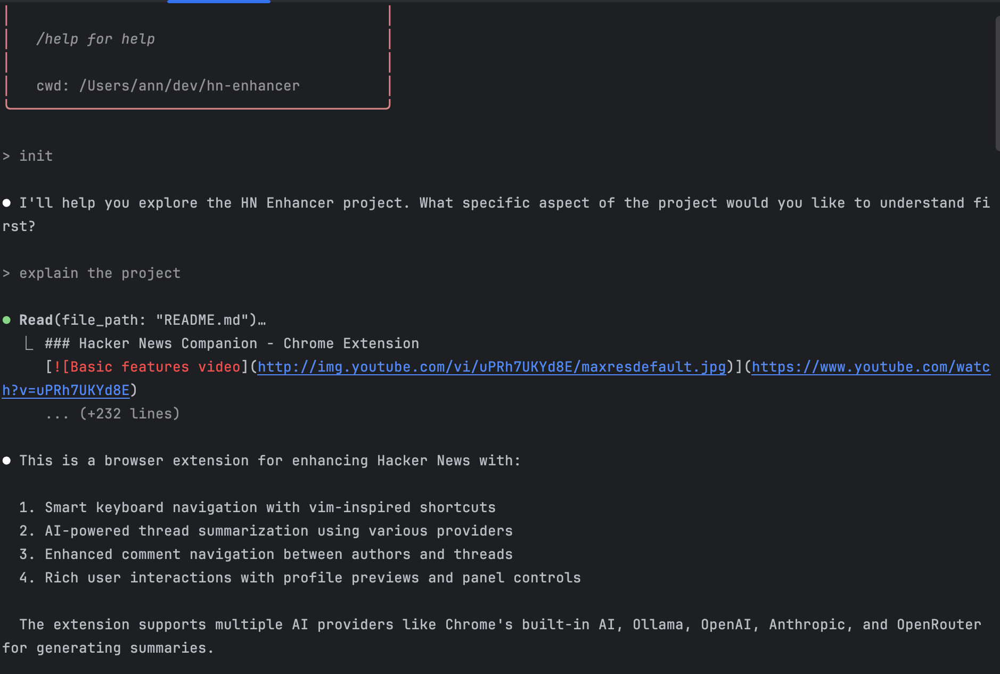
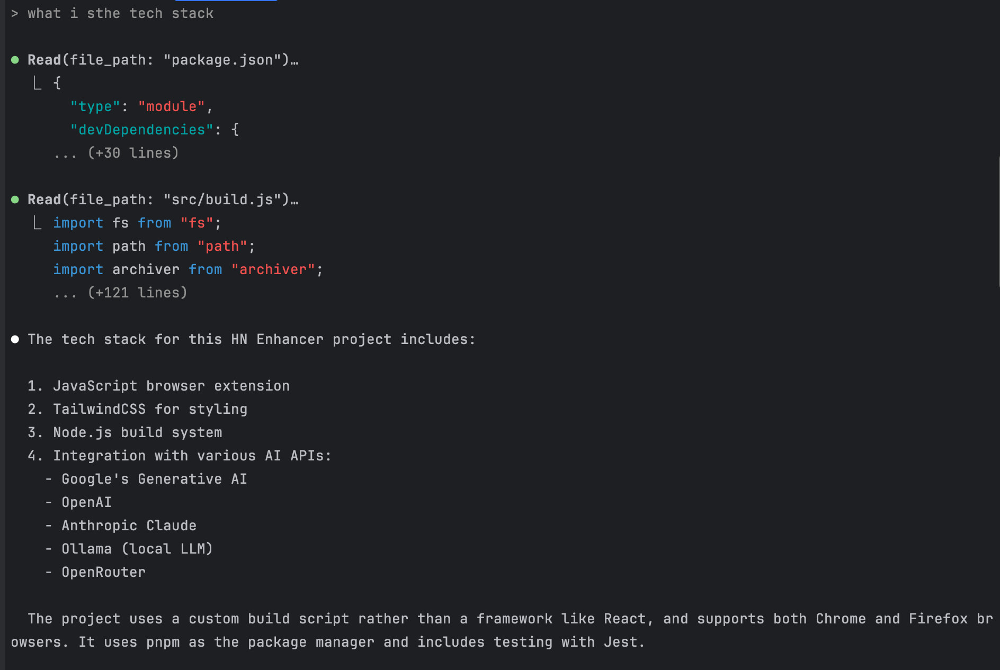
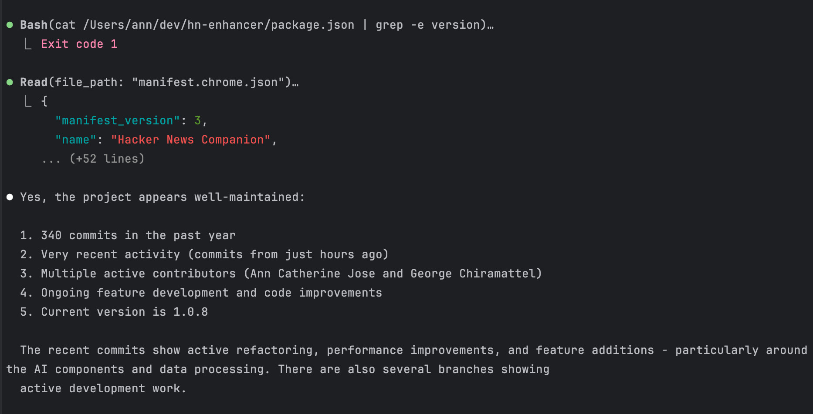

+++
title = "Claude Code: First Impressions"
description = "Exploring Anthropic's new CLI-based agentic coding tool"
date = "2025-02-24T04:32:12-07:00"
draft = false
tags = ["ai", "coding-assistants", "agentic-systems", "llm"]
topics = ["tech-explorations"]
+++

Today I tried [Claude Code](https://docs.anthropic.com/en/docs/agents-and-tools/claude-code), the new agentic coding tool [announced by Anthropic](https://www.anthropic.com/news/claude-3-7-sonnet) this morning. Unlike other agentic tools, Claude Code is a CLI tool.

Claude has been my favorite AI coding partner so far. I use it via GitHub Copilot and as standalone through its web interface. I was curious to see how it works in CLI and decided to give it a try.

In this post, I share my first impressions of using Claude Code - how I set it up, what I loved about it, what I didn't, and how it compares to other similar tools.

## Initial set up
I installed it as per steps in the [Claude Code documentation](https://docs.anthropic.com/en/docs/agents-and-tools/claude-code). It is as simple as this:
``` bash
npm install -g @anthropic-ai/claude-code
cd your-code-folder
claude init
```

It worked smoothly on macOS, but didn't work on a Windows machine. 

Few things to note:
1. Note that the last step will initiate a one-time OAuth flow to authenticate with your Anthropic API account, so you need to have billing set up.
2. I ran the **claude init** command in my IDE's terminal window with my [HN Companion project](https://github.com/levelup-apps/hn-enhancer) open. This made it easy for me to see the source files and the Code output side by side.

Just by running this command, it scanned all the files in the project and gave a concise, accurate overview of the code.



**Pro tip**: When you run this command, Claude creates a file **claude.md** in the project root. In this file, you can give detailed instructions on how you want Code to behave - a great way to tailor its analysis to your specific needs. You can commit this file to the repo to share with your team.

## Let the fun (chat) begin
Now that the set up is done, I started asking questions to Claude Code. 

First, I asked *What is the tech stack?*', it gave details on APIs, build tools, libraries. It correctly identified that the project uses pnpm package manager and supports Chrome and Firefox browsers.


This seems to be a great way to explore any project - start with a high-level summary and then dive deeper as needed. Definitely a time-saver when you want to understand any codebase - no matter how big they are. Like all things with AI, it enables you to do things not only faster, but also cross the mental boundaries of what you thought was possible.

Next, I asked - *is the project well maintained?*

It went through several steps, analyzed the git history for last 3 months, project releases etc. and finally gave a comprehensive answer to the question. 

Look at the nuance in the final answer. It's not just a yes or no, but a detailed analysis of the project's maintenance status with quantifiable metrics. Very impressive!



## Bigger questions
Next, I asked Claude Code to review a JS file I was working on this morning and suggest improvements.

It came up with 7 suggestions—covering code structure, error handling, performance, documentation, etc. I asked it to implement two of them (#3 & #4) - one of them to improve async/await handling.

Results:
- It tried to implement the changes, but picked #5 instead of #4. 

- It did ask for permission to run npx commands and make edits to the file, which was 🔥.

- However, the implementation overcomplicated things - for eg: it added a new package unnecessarily to improve async handling. Not great ☹️.

## What stood out to me

- Claude Code runs in your terminal and takes actions in realtime - not just answer questions from 'memory'.

- It understands your whole codebase, so you don't need to manually add files to the context.

- Each time it wanted to run a git or bash command (using its agentic tools), it asked for permission, that is 🔥.

- The playful progress messages were delightful: Honking, Herding, Cooking ❤️. And yes, at one point, I even saw Clauding! Looks like it’s officially becoming a verb. 😄

## What didn't impress me
It showed the code diff in red/green colors in the terminal, but it was hard to follow compared to how I see the diffs in WebStorm/VS Code/ GitHub.

Interestingly, it didn't give any suggestions about adding or improving tests - something I would’ve expected from an AI coding assistant.

## Gotchas
Claude Code uses the API, so remember that you will run through your token credits. So keep an eye on your [Anthropic API Usage Dashboard](https://console.anthropic.com/settings/usage).

## Comparison with similar tools
The direct equivalent of Claude Code is [GitHub Copilot Workspaces](https://githubnext.com/projects/copilot-workspace), the agentic dev environment from GitHub team. It enables you to give high level instructions and it will do all the tasks. It is in Technical Preview now, but is pretty stable. We had used it to for the HN Companion project and were able to implement a couple of features end to end with it.

However, it runs on the browser as a web app to take the initial instructions, so it feels disjoint from the coding environment. Once the initial step is done, you can modify the code, add tests, create PR etc. 

I like that Claude Code is closer to where I code, so it feels more natural. It also felt more interactive than Copilot Workspaces because it asks for permission to run commands, and you can ask it questions too. It gives you more control over the process, which is great!

## Further Reading
- [Claude Code documentation](https://docs.anthropic.com/en/docs/agents-and-tools/claude-code)
- [HN Discussion on Claude Code and Claude 3.7 Sonnet](https://news.ycombinator.com/item?id=43163011)

## Conclusion
Claude Code is a great tool to explore and understand any codebase. It's a great addition to my AI pair programming toolset. I will definitely use it more and more. You should give it a try too!

Claude Code has huge potential. If Anthropic nails the user experience and integrates it seamlessly and directly into IDEs, it could surpass Copilot, Cursor, Windsurf, etc., and change the game again!

Most capable coding model + best UX = 🔥

I can’t wait to see how it evolves! Go Anthropic! 🙌 💪


