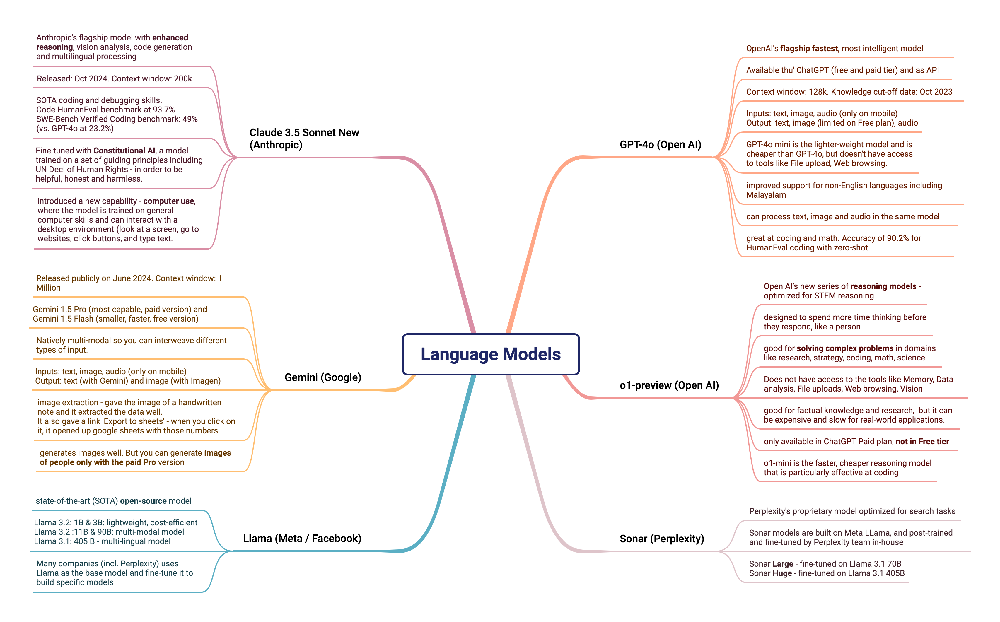
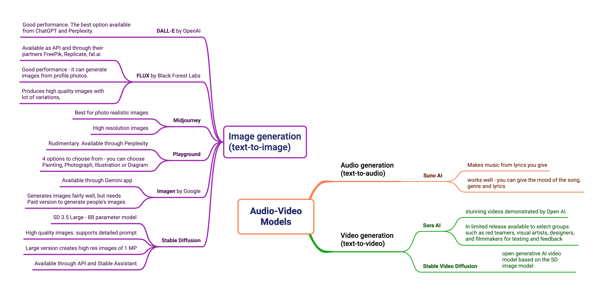

+++
title = "Compare AI Tools: LLMs and AI Assistants"
description = "Side by side comparison of AI tools and models useful for everyday tasks"
date = "2024-10-25T17:22:33-07:00"
draft = false
tags = ["tech-explorations", "LLM", "generative-ai"]
topics = ["AI"]
+++

In this post, we will compare the most popular AI tools (frontier models and AI assistants) based on its capabilities, limitations and my personal experience of using them day-to-day. 

In order to accomodate the multiple dimensions of each model, this comparison is represented as mind maps in three parts:
1. **Language models** - the most popular text-based models that are used for text-to-text content generation.
2. **AI assistants** - the chatbots that are powered by one or more of the above models.
3. **Other models** - other models that are used for text-to-image, text-to-voice or text-to-video use cases.

At the end, we will also see the common set of tasks that we try to accomplish using these tools and recommendations on which tool is best for each task.

Note - this is not an exhaustive list, just the tools that I have explored and used. Also, these tools are constantly evolving, so this comparison is relevant at this point in time and will change very soon.

## Comparison of language models

## Comparison of AI Assistants

## Comparison of other models

## Best tools for the common tasks
The table below shows the common tasks that can be done using the AI tools, specifically available through an AI assisant. I give suggestions on which tools are best for each task and my own preference of the tool that I use personally.

{{< pure_table

"Task | Good Tools  |  My Preference"

"Knowledge discovery, searching for any up-to-date information   | ChatGPT, Perplexity AI , Microsoft Copilot  |  Perplexity AI because it gives citations to verify the response"
"Finding infomation and learning any topic - health, medicine, technology| Perplexity AI , Microsoft Copilot  |  Perplexity AI because it gives citations., and you can publish your pages for others"
"Creative writing - essays, formal letters, poems, video script | ChatGPT, Claude Sonnet 3.5 New | Claude Sonnet 3.5 New (it is more coherent and generates language within context)"
"Analyzing academic papers and research articles |Claude Sonnet 3.5 New, ChatGPT |Claude Sonnet 3.5 New "
"Step-by-step reasoning, problem solving     | Claude 3.5 Sonnet New, Open AI o1-preview |  Both models are equally good. I would use the output of one model to judge the results of the other."
"OCR (extracting info from images)     | ChatGPT, Perplexity AI, Google Gemini  | Google Gemini (gives the option to create a google sheets from the data)"
"Image generation  | DALL-E, Midjourney, FLUX  | DALL-E for artistic images, FLUX through Freepik for random images, Midjourney for photo realistic images  "
"Create music  | Suno AI | Suno AI"
"Coding Assistant  | GitHub Copilot, Cursor AI  | GitHub Copilot in JetBrains IDE "
"Coding with Reasoning and Debugging  | GPT-4o, Claude 3.5 Sonnet New  | Claude 3.5 Sonnet New mostly"

>}}
