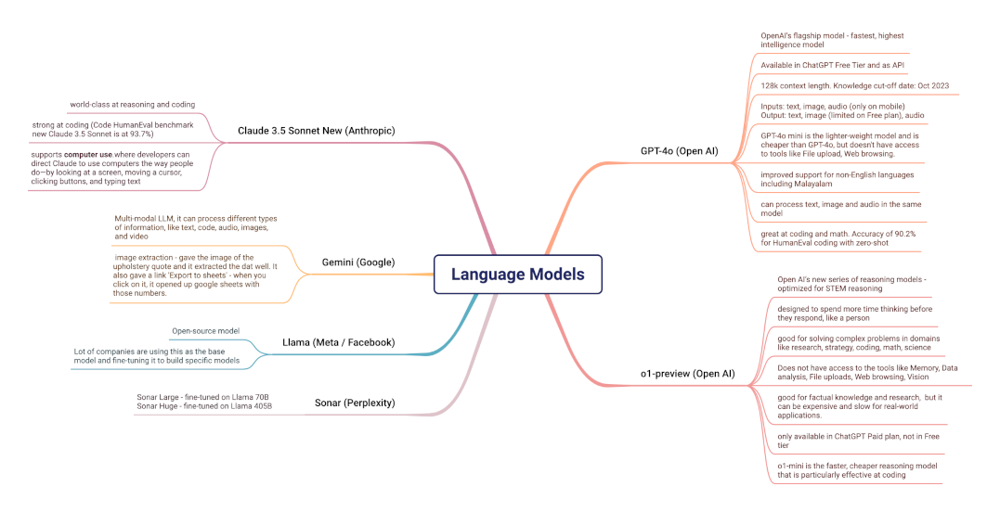
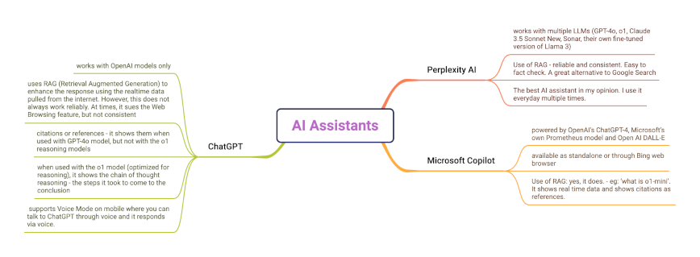
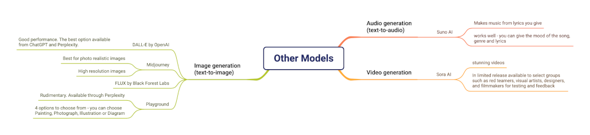

+++
title = "Compare LLMs and AI Assistants"
description = "Side by side comparison of AI tools for everyday tasks"
date = "2024-10-25T17:22:33-07:00"
draft = false
tags = ["how-to", "generative-ai"]
topics = []
+++

In this post, we will compare the most popular AI tools (frontier models and AI assistants) based on its capabilities, limitations and how I found them useful in my day-to-day use. 

There are multiple models to look at and multiple dimensions for each model. So they are represented as mind maps in three sections:
1. **Language models** - the most popular text-based models that are used for text-to-text content generation.
2. **AI assistants** - the chatbots that use one or more of the above models.
3. **Other models** - other models that are used for text-to-image, text-to-voice or text-to-video use cases.

At the end, we will also see the common set of tasks that we try to accomplish using these LLMs and recommendations on which tool is best for each task.

Note - this is not an exhaustive list, just the tools that I have explored and used. Also, these tools are constantly evolving, so this comparison is relevant at this point in time and will change very soon.

## Comparison of language models

## Comparison of AI Assistants

## Comparison of other models

## Best tools for the common tasks
The table below shows the common tasks that we try to do using the AI tools, suggestions on which tools are best for those tasks and my individual preference (the tool that I use personally).

{{< pure_table
"Task | Good Tools  |  My Preference"
"Explore world knowledge with latest up-to-date information     | ChatGPT, Perplexity AI , Microsoft Copilot  |  Perplexity AI in regular mode because it gives references and citations to verify the answer"
"Creative writing - write essays, formal letters, poems | ChatGPT, Claude Sonnet 3.5 New | Claude Sonnet 3.5 New"
"Ask questions about any topic - health, medicine, nations, technology| Perplexity AI , Microsoft Copilot  |  Perplexity AI because it gives references and citations and you can publish your pages"
"Step-by-step reasoning, problem solving     | Claude 3.5 Sonnet New, Open AI o1-preview |  Both models are equally good, so I will use one model to judge the results of the other."
"OCR (extracting info from images)     | ChatGPT, Perplexity AI, Google Gemini  | Google Gemini (gives the option to create a google sheets also)"
"Image generation  | Open AI DALL-E, Midjourney, Freepik with AI  | DALL-E for artistic images, Midjourney for photo realistic "
"Create music  | Suno AI | Suno AI"
"Coding Assistant  | GitHub Copilot, Cursor AI  | GitHub Copilot in JetBrains IDE "
"Coding with Reasoning and Debugging  | GPT-4o, Claude 3.5 Sonnet New  | Claude 3.5 Sonnet New "
>}}
