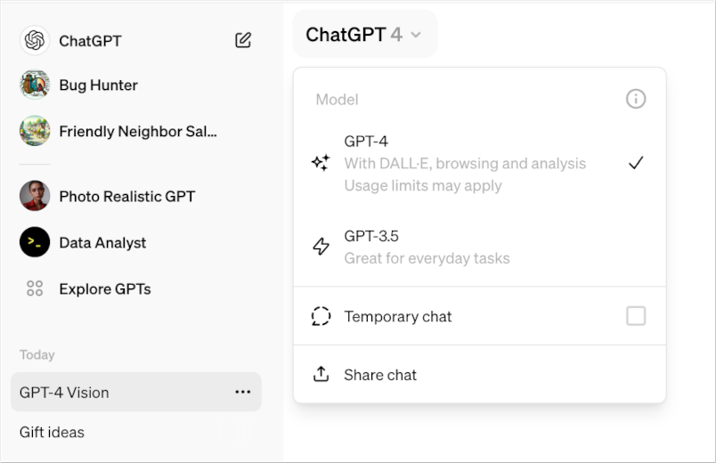
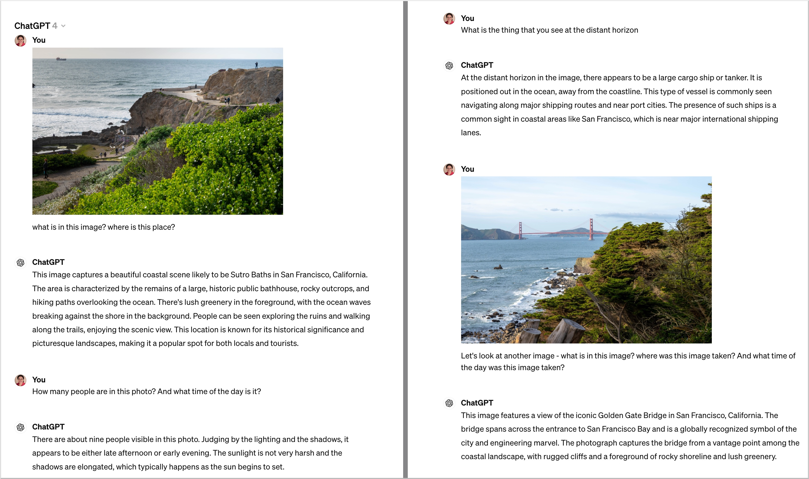

+++
title = "GPT-4 Turbo Vision: In Action"
description = "A practical guide to using GPT-4 Turbo Vision"
date = "2024-04-04T21:12:23-07:00"
draft = false
tags = ["LLM", "how-to", "tech-explorations", "generative-ai"]
topics = []
+++

It's been a few months since OpenAI announced [GPT-4 Turbo with Vision](https://openai.com/index/new-models-and-developer-products-announced-at-devday) a model capable of understanding images and answering questions based on visual input. Recently, I decided to leverage this in a real app and got valuable insights. This post is a quick summary of my learnings from that experience. 

We'll explore how to use the model through ChatGPT and the Open AI API so that you can can integrate it into any application. I'll wrap up with my observations from using this model in practice.

## Accessing the Vision Model through ChatGPT
The Vision model is built into [GPT-4 Turbo](https://platform.openai.com/docs/models/gpt-4-turbo-and-gpt-4#gpt-4-turbo-and-gpt-4), a multimodal model that accepts text or image as inputs. So you can directly use it in ChatGPT - just select the **GPT-4** option in the model dropdown at the top left corner.

**Note** - As of today, this feature is available only in the paid ChatGPT subscriptions (Plus or higher).



Once you have selected this model, you can open the chat window, upload any image and ask questions about the image. For example, here is how it interpreted an image I provided:


## Using the Vision Model through OpenAI API
You can use this model through the [OpenAI API](https://platform.openai.com/docs/api-reference) if you have API access to GPT-4. Simply use the Chat Completions API and pass in **gpt-4-vision** as the model name in the API.

Here is a quick code snippet:
``` typescript
// imageFile is a File object. Convert it to base64-encoded string
const arrayBuffer = await imageFile.arrayBuffer();
const base64ImageBuffer = Buffer.from(arrayBuffer).toString('base64');

// construct the data url from the base64 encoded string and file extension 
const fileExtension = imageFile.name.split('.').pop();
const base64ImageDataUrl = `data:image/${fileExtension};base64,${base64ImageBuffer}`;

const openai = new OpenAI();

const response = await openai.chat.completions.create({
    model: "gpt-4-vision",
    messages: [
        {
            role: "user",
            content: [
                {
                    type: "text",
                    text: `What’s in this image? Where is this place?`
                },
                {
                    type: "image_url",
                    image_url: {
                        url: base64ImageDataUrl
                    }
                },
            ],
        },
    ],
});

console.log(`\nResponse: ${JSON.stringify(response.choices[0])}`);
```

## My observations
Overall, this vision model is pretty good - at least as a starting point. 

I was able to use it in my Keep Seek app and extract meaningful information from many images I gave it. The API is stable and reliable, although not very fast - responses took an average of 2-3 seconds.

I found it be very useful to analyze images through ChatGPT, especially to digitize some of the handwritten notes.

I am looking forward to seeing this model become faster and more reliable, and eventually being available to all users soon.