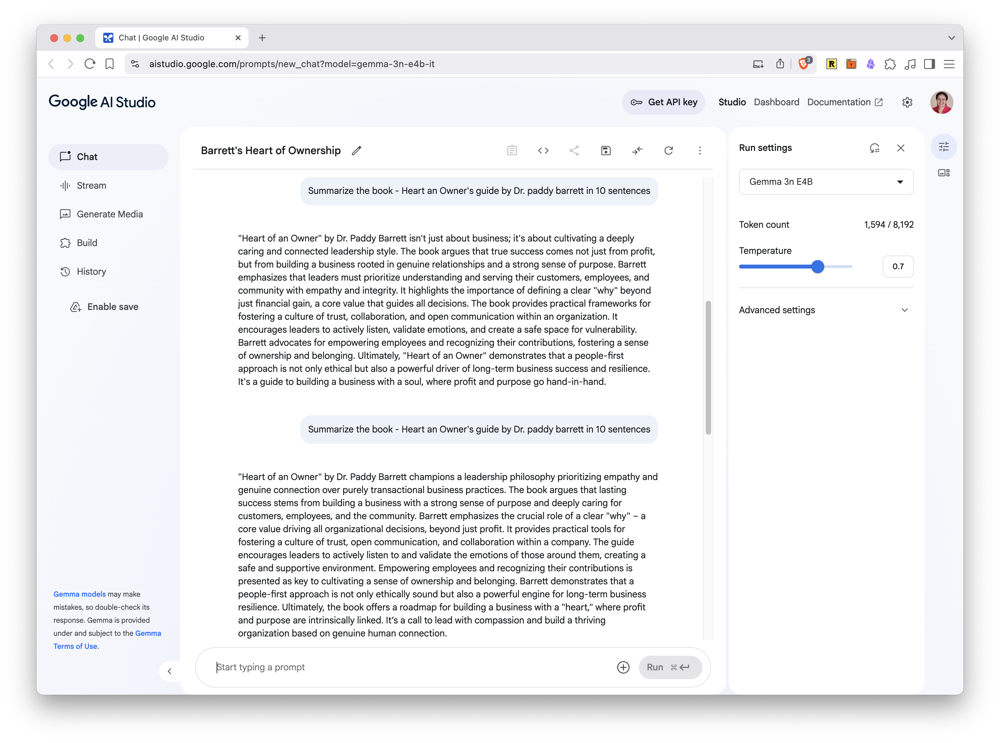
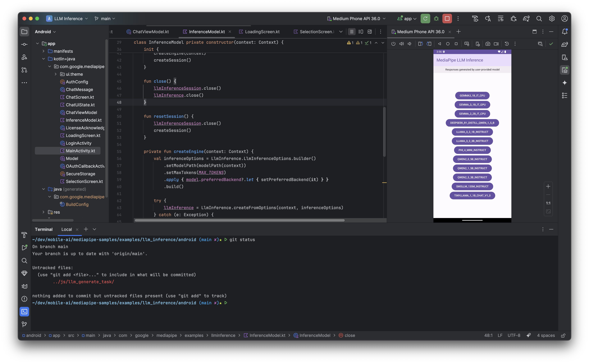
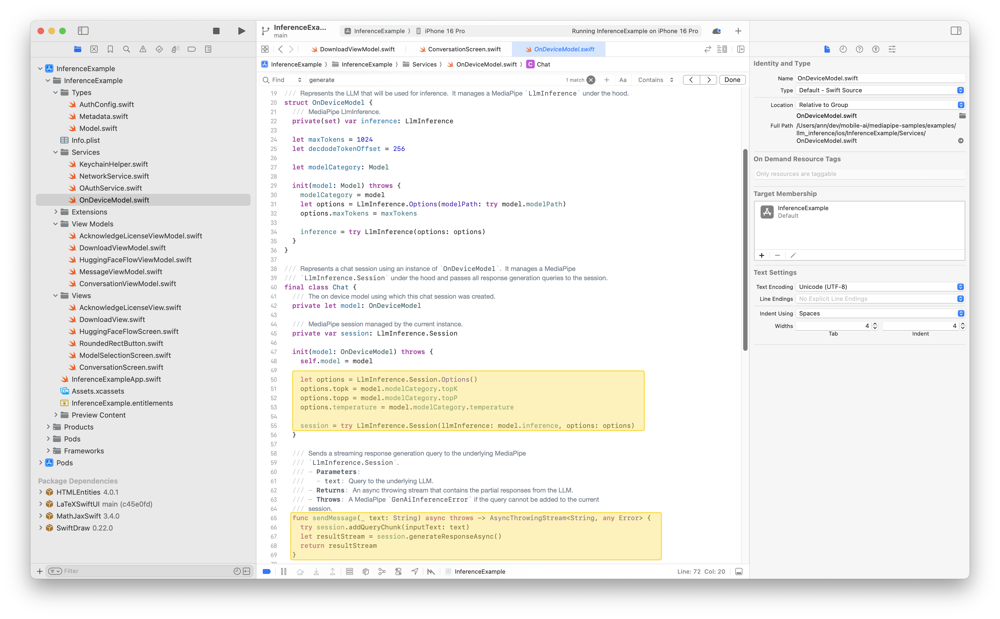

+++
title = "Hands-On: Mobile AI with Gemma - iOS, Android"
description = "Practical guide to run mobile-optimized models like Gemma across mobile platforms"
date = "2025-06-03T13:13:12-07:00"
draft = false
tags = ["mobile", "ai", "mobile-development", "privacy", "gemma", "hands-on"]
topics = ["tech-explorations", "on-device-ai", "edge-ai"]
+++

In our previous post, [Mobile On-device AI: Smarter Faster Private Apps](/post/mobile-on-device-ai/), we explored the fundamentals of running AI locally on mobile devices. Now, it's time to get hands-on and see this technology in action!

This practical guide walks you through implementing mobile on-device AI using Google's powerful Gemma model family, including the cutting-edge Gemma 3n. You'll learn to deploy these models across iOS, Android, and web platforms using industry-standard frameworks.

### What You'll Learn Here
- Test various Gemma models, including Gemma 3n, in Google AI Studio.
- Run sample on-device AI applications on Android using tools like the Google AI Edge Gallery App and MediaPipe.
- Implement on-device Large Language Model (LLM) inference on iOS using MediaPipe.
- Explore how to run LLMs in mobile web browsers with JavaScript and MediaPipe.
- Gain practical experience deploying and interacting with Gemma models across different mobile platforms.

**Prerequisites:** Basic mobile development knowledge helpful but not required.

**Time needed:** 1-2 hours depending on platforms explored

### Navigating this guide
1. [Understanding Gemma Models](#understanding-gemma-models)
2. [Deep Dive: Gemma 3n (Features & Architecture)](#deep-dive-gemma-3n)
3. [Frameworks in Action: Apple Core ML & Google AI Edge](#frameworks-in-action)
4. [Running Gemma in Google AI Studio](#1-run-gemma-in-google-ai-studio)
5. [Running Gemma on Android](#2-run-gemma-on-android)
6. [Running Gemma on iOS](#3-run-gemma-on-ios)
7. [Running Gemma in Mobile Web Browsers (Bonus Content)](#4-run-gemma-on-mobile-browsers-bonus-content)
8. [Cross-Platform Summary](#cross-platform-summary)
9. [Conclusion & Next Steps](#conclusion)
10. [References](#references)

## Understanding Gemma Models

Before we dive into the hands-on tutorials, it’s helpful to understand the Gemma model family – proprietary Gemini Nano and the latest Gemma 3n. While both are highly optimized for on-device tasks, they cater to different use cases and feature distinct access models for our primary example for this guide – and its significance in the on-device AI landscape, especially the newer Gemma 3 developers. 

Let's compare them side-by-side to better understand Gemma 3n's role:

{{< pure_table
"Feature                 | Gemini Nano                                                                | Gemma 3n"
"Mobile Optimization | Highly optimized for resource-constrained devices (e.g., <4GB RAM devices) | Optimized for medium-tier devices (e.g., phones/tablets with 4-8GB RAM)"
"Device Support      | Wearables, IoT, low-end Android phones                                     | Android, iOS, tablets, laptops"
"Model Access        | Proprietary - Available via Android AICore/ML Kit GenAI APIs (restricted) | Open weights - available at Kaggle Model Hub or LiteRT HuggingFace community"
"Use Cases           | On-device AI features in Pixel devices, Google Messages Smart Reply  | Custom LLM apps, Cross-platform AI features, Local RAG implementations"
"Feasibility         | Limited to Google's integrated use cases                                     | Designed for broader developer access"

>}}

### Where to Find These Models
*   **Gemma Models (including Gemma 3n and earlier versions):**
    *   Kaggle Model Hub: [models.kaggle.com/google/gemma](https://models.kaggle.com/google/gemma) (Official source for Gemma open models)
    *   Hugging Face (LiteRT Community for Gemma 3n Preview): [huggingface.co/collections/google/gemma-3n-preview...](https://huggingface.co/collections/google/gemma-3n-preview-682ca41097a31e5ac804d57b) (For the Gemma 3n preview specifically optimized with LiteRT)
*   **Gemini Nano:**
    *   Access for developers is typically indirect, through Android APIs like **AICore** or as part of **ML Kit's GenAI features**. Direct model download is not generally available due to its proprietary nature. ([Learn more about Gemini Nano on Android](https://developer.android.com/ai/gemini-nano))

Despite their differences in access and target use cases, both model families stem from Google's advanced AI research. We will likely see continued evolution in their capabilities, how they are delivered, and the business models surrounding them for on-device applications. For this hands-on guide, we will primarily focus on the openly accessible Gemma models, particularly Gemma 3n, due to their suitability for broader developer experimentation.

## Deep Dive: Gemma 3n
This is the latest open model optimized to run on mobile devices with at least 2GB RAM. It provides real-time AI on phones, tablets and laptops. It is in early preview and is available on Google AI Studio, Google AI Edge SDK and [LiteRT HuggingFace community](https://huggingface.co/collections/google/gemma-3n-preview-682ca41097a31e5ac804d57b). 

Gemma 3n can be deployed on mobile devices using the MediaPipe library of Google AI Edge SDK that we saw earlier. It is built on the same advanced architecture that powers **Gemini Nano**, the flagship mobile-optimized model. The development of Gemma 3n is a collaboration between Google DeepMind, Qualcomm, and Samsung, ensuring that it is engineered for high performance and efficiency across a wide range of mobile hardware.

In short, Gemma 3n is the mobile-optimized, multimodal model that enables developers to build mobile-first AI applications - everything runs locally.

### Key Features
- **Natively Multimodal:** Supports text, image, audio, and video inputs and outputs
- **Multi-Lingual:** Offers robust support for multiple languages - trained over 140 languages
- **Open Weights:** The model is available under open weights, encouraging community development and transparency
- **Realtime Capabilities:** Enables real-time transcription, translation, and voice interactions directly on device
- **Extended Context Length:** Supports a context window of up to 32K tokens, significant input length for complex and lengthy data

### Gemma 3n Model Variants (Preview)

During the initial preview phase, Google has made two primary variants of Gemma 3n available, differing mainly in their effective parameter size:

1.  **Gemma 3n E2B** (Effective 2 Billion Parameters): This variant is optimized for scenarios requiring a very lean model while still delivering strong performance.
    *   Find it on Hugging Face: [google/gemma-3n-E2B-it-litert-preview](https://huggingface.co/google/gemma-3n-E2B-it-litert-preview)
2.  **Gemma 3n E4B** (Effective 4 Billion Parameters): Offering a step up in capability, this variant balances enhanced performance with on-device efficiency for more demanding tasks.
    *   Find it on Hugging Face: [google/gemma-3n-E4B-it-litert-preview](https://huggingface.co/google/gemma-3n-E4B-it-litert-preview)

These models are typically provided in formats optimized with LiteRT for on-device inference.

**For Reference**: It's also useful to be aware of previous Gemma iterations. For example, the **Gemma 3-1B** model, an earlier version, can be found here:
*   **Gemma 3-1B (LiteRT Community):** [litert-community/Gemma3-1B-IT](https://huggingface.co/litert-community/Gemma3-1B-IT)

### Naming is hard, but fun too!
There are a few subtle elements in the name of the Gemma models that are interesting to know.
- The **n** suffix in the model name refers to the *nano-sized* models in the Gemma family, specifically optimized for resource-constrained devices like mobile phones and wearables
- The **E** prefix in the Gemma 3n model names stands for the *Effective* parameter size, indicating the reduced, or effective, number of parameters the model actually needs to use during inference on a device, rather than the total parameter count stored in the model files. For example, the Gemma 3n E2B model contains 5 billion parameters, but it can operate with an effective memory footprint of 2B parameters because of the techniques like Per-Layer Embedding (PLE) caching and selective activation of parameters. Similarly the E4B model needs only 4B parameters to be active at run time even though it is a 8B parameter model.

### Architecture of Gemma 3n
There are a few important aspects of the new architecture that powers Gemma 3n and the Gemini Nano models.
- **PLE Caching:** PLE (Per-Layer Embedding) parameters are generated separately and cached in fast storage, then added during inference, reducing the memory footprint at runtime
- **Selective Parameter Activation:** The model can dynamically load only the parameters needed for the current task (e.g., text, image, or audio), further reducing resource use. The model with 4B active memory footprint embeds a nested state-of-the-art submodel with 2B active memory footprint. This allows the model to dynamically load the relevant submodel to balance performance and quality based on device capabilities, user query etc.
- **MatFormer Architecture:** This allows the model to nest smaller submodels within a larger one, so only the relevant submodel is activated per request, minimizing compute and memory requirements

## Frameworks in action

Once you have an optimized AI model (like the ones discussed in the Models section above), you need a way to actually run it on a mobile device. This is where on-device AI frameworks and runtimes come into play. They provide the necessary engine and tools to efficiently execute these models, manage resources, and often interact with device hardware for acceleration. 

The two main players in the mobile ecosystem are:

*   **Google AI Edge:** Google's comprehensive suite for on-device AI - libraries, tools, and frameworks designed to deploy and run ML models directly on edge devices. Key components include:
    *   **LiteRT (formerly TensorFlow Lite):** A crucial open-source runtime for executing a wide range of optimized models, including Google's Gemma family and custom-trained models, on Android, iOS, and other platforms. You can choose a model for your use case, convert it to the LiteRT format, and run it on-device. [More info](https://ai.google.dev/edge/litert/next/overview)
    *   **MediaPipe:** Offers pre-built, customizable solutions for tasks like vision and audio processing, often leveraging LiteRT. You can choose the task that solves your AI/ML problem, and implement it on multiple platforms. If you intend to use MediaPipe Tasks, refer to the [MediaPipe Tasks documentation](https://ai.google.dev/edge/mediapipe/solutions/tasks) and all the [MediaPipe samples](https://github.com/google-ai-edge/mediapipe-samples/tree/main/examples).
    *   **ML Kit:** Provides easy-to-integrate APIs for common AI features, sometimes powered by models like Gemini Nano under the hood for specific functionalities within Google's ecosystem or via new GenAI APIs. See more info at [ML Kit docs](https://developers.google.com/ml-kit)

*   **Apple Core ML:** Apple's dedicated framework for running machine learning models efficiently and privately on iOS, macOS, and other Apple platforms. It works with models converted to its specific format and optimizes execution across Apple's CPU, GPU, and Neural Engine.

## Deep Dive: Apple Core ML
Core ML is Apple’s framework for running machine learning models on iOS, macOS, tvOS, and watchOS devices. It is designed for on-device inference, minimizing memory footprint and power consumption while keeping data private. It leverages Apple silicon, including the CPU, GPU, and Neural Engine, to maximize speed and minimize memory footprint and power consumption.

It works with Vision (for image and video analysis), Natural Language (for text processing), and GameplayKit (for game AI). Models trained in TensorFlow, PyTorch, or other frameworks can be converted to Core ML format using Core ML Tools, making it straightforward to deploy existing models on Apple devices.

### How CoreML works
- **Model Preparation:** ML models are trained on powerful computers and converted to the Core ML format (`.mlmodel`), optimized for Apple hardware - using [Core ML Tools](https://apple.github.io/coremltools/docs-guides/source/introductory-quickstart.html)
- **Integration:** The `.mlmodel` file is added to an Xcode project. Xcode automatically generates a Swift or Objective-C class for the model (`.mlmodelc`), providing type-safe access to inputs and outputs
- **Execution:** The app passes input data (e.g., images, text) to the model. Core ML dispatches computations to the most appropriate hardware (CPU, GPU, or Neural Engine) for efficient inference
- **Stateful Models:** Recent Core ML updates support stateful models (like those used in generative AI), managing state (such as key-value caches for language models) to improve efficiency and reduce overhead    
- **Performance Profiling:** You can can profile model performance, identify bottlenecks, and optimize models for specific hardware using tools in Xcode and Core ML Tools

Here is how you can use a model using Core ML in your app. Note - `.mlmodelc` is the compiled version of the model you imported into XCode.
``` swift
	guard let modelURL = Bundle.main.url(
                            forResource: "CoreMLTrainedModel", 
                            withExtension: "mlmodelc") else {
	    fatalError("Failed to locate the Core ML model file.")
	}
	do {
	    let model = try MLModel(contentsOf: modelURL)
	    // Now you have Core ML model object ready to make predictions
	} catch {
	    fatalError("Failed to create Core ML model object: \(error)")
	}
```

 After this, you prepare your input data so it matches the requirements of your model. This might involve resizing images, normalizing values, or encoding text. For example, you may need to resize an image to a specific dimension before passing it to the model. Then, pass the prepared input data to the model’s prediction method. The model will process the input and generate an output. Once you receive the model’s output, interpret and use it as needed in your app. Finally, display the results to the user.

Read more about it at [CoreML Quick Start Guide](https://apple.github.io/coremltools/docs-guides/source/introductory-quickstart.html).

## Hands-on: Running Gemma Models on mobile devices

Ok, let’s roll up our sleeves and see these models in action. We can do that in a few places:

1. **Google AI Studio:** This is Google’s interactive playground where you can try out their various models, including the latest Gemma 3n, using a chat-like interface. It’s often the simplest way to get a quick feel for a model's capabilities.

2. **Sample apps from MediaPipe:** MediaPipe provides a collection of sample applications for Android, iOS, and web browsers that demonstrate how to run various on-device models. These are excellent for seeing practical implementations. You can typically find these within the **[MediaPipe solutions documentation](https://ai.google.dev/edge/mediapipe/solutions)**.

3. **Google AI Edge Gallery app:** This new app from Google AI Edge SDK lets you download and run models like Gemma 3n directly on your Android device, offline. The app is open source and available on **[GitHub: google-ai-edge/gallery](https://github.com/google-ai-edge/gallery)**

**Note:** The mobile setup is fairly easy. You don’t need advanced mobile expertise - just a compatible USB cable and the ability to follow instructions.

### 1. Run Gemma in Google AI Studio

This is the fastest way to try out Gemma 3n without any setup hassle. 
- Go to [Google AI Studio](https://aistudio.google.com/prompts/new_chat) and login with your Google account
- Select the **Gemma 3n 4B** model in the dropdown menu on the right. 
- Start chatting with the model right away. Adjust the parameters like temperature, TopP etc. as you wish.
- Other Gemma models are also available here. You can use any of them.

Here is a screenshot of Google AI Studio running Gemma 3n 4B. As you can see, the answer to my question about a new book on heart health didn't come out correctly. This is a limitation of smaller models.


### 2. Run Gemma on Android

We have two options to run Gemma models on Android:
#### 2.1 MediaPipe Android Sample App
This app demonstrates all supported Small Language Models (SLMs) like Gemma 2, Gemma 3, Microsoft Phi, and QWEN. It’s available on [GitHub: google-ai-edge/mediapipe-samples](https://github.com/google-ai-edge/mediapipe-samples). There are many examples here, the easiest one to run is the [LLM inference sample app](https://github.com/google-ai-edge/mediapipe-samples/tree/main/examples/llm_inference/android).

 Just clone the repo, navigate to the folder `mediapipe-samples/examples/llm_inference/android`, open the project in Android Studio and build. When you run the app, you can choose a model and the app will download the model to the device and run it. If the model you choose needs permissions, the app will show HuggingFace screen to acknowledge the license.

**Drawbacks:** 
The sample app is minimal, somewhat outdated, and not as polished as newer offerings. More importantly, **you cannot run Gemma 3n models** in this app. I tried to modify the code and add Gemma 3n manually, but it resulted in the error - “Access denied. Please try again and grant the necessary permissions”, even though the right permissions were set up on Hugging Face. 

In my understanding, this suggests the app is explicitly restricted from running newer models like Gemma 3n. But it can run Gemma 3, Gemma 2, smaller Llama 3/2, Microsoft Phi and Qwen.

Here are some screenshots of Android MediaPipe sample app running on my Pixel 8 Pro Android device:


And the sample app code in Android Studio


#### 2.2 Google AI Edge Gallery App
This is a newer, more versatile sample app available as an experimental Alpha release. It’s sleek, easy to use, and demonstrates the full power of on-device AI. You can run Gemma 3n models (E2B and E4B) directly on your device, but not older models.    
- **Instructions to download and run:** - [Gallery App Wiki](https://github.com/google-ai-edge/gallery/wiki/2.-Getting-Started)
- **How it works:** After installing, select a model from the list (such as Gemma 3n E2B or E4B), and you can start using AI features like chat, image analysis, and more - all offline.

The full source code is available at [GitHub: google-ai-edge/gallery](https://github.com/google-ai-edge/gallery)

Here are some screenshots of Gallery app running on my Pixel 8 Pro Android device - the home page that shows the tasks it supports, asking the user to review the license of Gemma 3n and downloading the Gemma 3n model:



The gallery app supports three three main type of tasks - Chat, Explain Image and Summarize.


See detailed instructions for each app:
- **MediaPipe Sample App:** [MediaPipe Samples GitHub](https://github.com/google-ai-edge/mediapipe-samples)
- **Gallery App:** [Google AI Edge Gallery GitHub](https://github.com/google-ai-edge/gallery)
In summary, use the old MediaPipe sample app to run models prior to Gemma 3n, and the new Gallery app to run Gemma 3n models. Google may consolidate these apps in the future or deprecate older models.

### 3. Run Gemma on iOS

The [MediaPipe LLM Inference API for iOS](https://ai.google.dev/edge/mediapipe/solutions/genai/llm_inference/ios) enables you to run LLMs directly on the iOS device. This allows you to perform advanced AI tasks such as text generation, information retrieval, and document summarization - all while keeping user data private and secure.

**Run the MediaPipe iOS sample app**

In terms of sample apps, the newer Google AI Edge Gallery app is not yet available for iOS; its release is marked as “coming soon.” But there is an [iOS version of old MediaPipe sample app](https://github.com/google-ai-edge/mediapipe-samples/tree/main/examples/llm_inference/ios) which demonstrates how to use the LLM Inference API in iOS applications.

This iOS sample app (similar to the Android sample app) cannot run the latest Gemma 3n model. But it can run earlier models like Gemma 3, Gemma 2, smaller Llama 3/2, DeepSeek distilled and Qwen. Here is how you can run the app:

- Clone the [mediapipe-samples GitHub repo](https://github.com/google-ai-edge/mediapipe-samples/tree/main)
- Run `pod install` in the folder `examples/llm_inference/ios`
- Launch Xcode and open the workspace file `InferenceExample.xcworkspace`
- Run the app with the Play button at the top
- If the model you choose needs permissions, the app will show HuggingFace screen to acknowledge the license

Here are some screenshots of iOS MediaPipe sample app running on iPhone 16 Pro with iOS 18.5:


#### Integrate the model and API manually

1. **Install the MediaPipeTasksGenai library**  - Add the necessary dependencies to your project using CocoaPods. Add the following to your `Podfile`:
```ruby
target 'MyLlmInferenceApp' do
  use_frameworks!
  pod 'MediaPipeTasksGenAI'
  pod 'MediaPipeTasksGenAIC'
end
```
Note - The library is compatible with both Swift and Objective-C apps and does not require any additional language-specific setup.

2. **Download the model** of your choice from [HuggingFace LiteRT community](https://huggingface.co/litert-community). You may need to convert the model to the MediaPipe compatible format using [AI Edge Torch Generative Converter](https://github.com/google-ai-edge/ai-edge-torch/tree/main/ai_edge_torch/generative). See the full instructions at [Model guide for LLM inference](https://ai.google.dev/edge/mediapipe/solutions/genai/llm_inference/index#models).
    
3. **Initialize the LLM Inference task**  - Configure the task with your model path and desired options. You can adjust the model parameters like **maxTokens**, **topk**, **temperature**, **randomSeed** and path to the model file as **modelPath**.
```swift
import MediaPipeTasksGenai

let modelPath = Bundle.main.path(forResource: "small-model", ofType: "bin")

let options = LlmInferenceOptions()
options.baseOptions.modelPath = modelPath
options.maxTokens = 1000
options.topk = 40
options.temperature = 0.8
options.randomSeed = 101

let llmInference = try LlmInference(options: options)
```
    
4. **Run the task and generate responses**  - Use the `generateResponse(inputText:)` method for single responses, or `generateResponseAsync(inputText:)` for streaming:
``` swift
// For single response
let result = try LlmInference.generateResponse(inputText: inputPrompt)

// For streaming:
let resultStream = LlmInference.generateResponseAsync(inputText: inputPrompt)
do {
  for try await partialResult in resultStream {
    print("\(partialResult)")
  }
} catch {
  print("Response error: \(error)")
}
```

Here is the sample app code in Xcode:


For detailed instructions and advanced setup, see the official documentation: [MediaPipe LLM Inference API for iOS](https://ai.google.dev/edge/mediapipe/solutions/genai/llm_inference/ios). The API also supports LoRA (Low-Rank Adaptation) for efficient fine-tuning of models, allowing you to customize model behavior for specific tasks.

### 4. Run Gemma on mobile browsers (Bonus Content)
You can run Gemma and other large language models directly in your browser using the MediaPipe LLM Inference API for JavaScript. This allows you to perform advanced AI tasks - such as text generation, information retrieval, and document summarization - entirely on-device, without sending data to a server.

**Supported Models**
- **Gemma-2 2B**, **Gemma-3 1B**, and other models like Phi-2 and StableLM are supported.
- **Gemma 3n (E2B, E4B)** is not currently listed as supported for the Web API.

It is fascinating to see the model loaded into the browser on your machine. Of course, tools like Ollama does the same, but it feels different when you see that happen in the context of a browser - which you usually think of as a lightweight window to the world wide web.

**Setup instructions**
See the full details at [LLM inference guide for Web](https://ai.google.dev/edge/mediapipe/solutions/genai/llm_inference/web_js)
- **Install the package:**
```bash
    npm install @mediapipe/tasks-genai
```
Or use the CDN:
```xml
	<script 
        src="https://cdn.jsdelivr.net/npm/@mediapipe/tasks-genai/genai_bundle.cjs" 
        crossorigin="anonymous">
    </script>
```
- **Download a model:**  For example, download Gemma-2 2B in 8-bit quantized format from Kaggle Models or HuggingFace LiteRT and place it in your project directory.
        
- **Initialize the task:** Load the task (eg: LLM inference) with its corresponding options.
``` javascript
    const genai = await FilesetResolver.forGenAiTasks(
	  "https://cdn.jsdelivr.net/npm/@mediapipe/tasks-genai@latest/wasm"
	);
	llmInference = await LlmInference.createFromOptions(genai, {
	  baseOptions: { modelAssetPath: '/assets/gemma-2b-it-gpu-int8.bin' },
	  maxTokens: 1000,
	  topK: 40,
	  temperature: 0.8,
	  randomSeed: 101
	});
```
- **Run inference:** Use the `generateResponse` function on the `llmInfernce` object as single response or streaming.
```javascript
  // single responce
	const response = await llmInference.generateResponse(inputPrompt);

  // or stream the output
	llmInference.generateResponse(
        inputPrompt,
        (partialResult, done) => {
            document.getElementById('output').textContent += partialResult;
        }
    );
```
        
- **Browser Compatibility** - Requires WebGPU support. Check the [GPU browser compatibility](https://ai.google.dev/edge/mediapipe/solutions/genai/llm_inference/web_js#gpu_browser_compatibility) page for details.
- **LoRA (Low-Rank Adaptation)** - You can fine-tune models using LoRA and load custom LoRA weights at runtime for specialized tasks.
        
See detailed instructions: [MediaPipe LLM Inference API for Web](https://ai.google.dev/edge/mediapipe/solutions/genai/llm_inference/web_js).

### Cross platform summary
The following table summarizes how to run the model on various platforms.



### Choosing Your Platform

**Start with Android if:**
- You want to try the latest Gemma 3n models
- You prefer more experimental, cutting-edge features
- You're comfortable with Alpha-quality tooling

**Start with iOS if:**
- You need production-ready stability
- You're building for Apple ecosystem
- You prefer mature, well-documented frameworks

**Start with Web if:**
- You want quick prototyping without mobile setup
- You're building cross-platform web apps
- You want to demo capabilities easily

## Conclusion
Getting hands-on with on-device AI, especially with powerful open models like the Gemma family, is more accessible than ever for mobile developers. By leveraging tools like Google AI Edge (with MediaPipe and LiteRT) and understanding native frameworks like Apple Core ML, you can build truly innovative, private, and responsive AI features into your iOS and Android applications. 

The landscape is evolving rapidly, particularly with models like Gemma 3n, opening up exciting possibilities for the future of mobile AI. We encourage you to experiment with the sample apps and start thinking about how you can integrate these capabilities into your own projects.

## Further Reading in this Series
*   [Edge AI Essentials](/post/edge-ai-essentials/)
*   [Mobile On-Device AI: Smarter and Faster Private Apps](/post/mobile-on-device-ai/)
*   [Hands-On: Mobile AI with Gemma - iOS, Android](/post/mobile-on-device-ai-hands-on-gemma/)

## References
**Google On-Device AI Models:**
*   Announcement of Gemma 3n at Google I/O 2025: [Google Developers Blog: Introducing Gemma 3n](https://developers.googleblog.com/en/introducing-gemma-3n/)
*   Google announcing on-device SLM, RAG and function calling: [Google AI Edge Blog](https://developers.googleblog.com/en/google-ai-edge-small-language-models-multimodality-rag-function-calling/)
*   Gemma Models Official Page: [ai.google.dev/gemma](https://ai.google.dev/gemma)
*   Gemma 3n Model overview [ai.google.dev/gemma/docs/gemma-3n](https://ai.google.dev/gemma/docs/gemma-3n)
*   Gemini Nano for Android: [developer.android.com/ai/gemini-nano](https://developer.android.com/ai/gemini-nano)

**Google AI Edge Framework**
*   TensorFlow Lite Guides: [tensorflow.org/lite/guide](https://www.tensorflow.org/lite/guide)
*   ML Kit: [developers.google.com/ml-kit](https://developers.google.com/ml-kit)
*   MediaPipe Solutions: [ai.google.dev/edge/mediapipe/solutions](https://ai.google.dev/edge/mediapipe/solutions)
*   MediaPipe samples: [github.com/google-ai-edge/mediapipe-samples/tree/main/examples](https://github.com/google-ai-edge/mediapipe-samples/tree/main/examples)

**iOS On-Device AI:**
*   Core ML Overview: [developer.apple.com/documentation/coreml](https://developer.apple.com/documentation/coreml)
*   LLM inference guide for iOS [ai.google.dev/edge/mediapipe/solutions/genai/llm_inference/ios](https://ai.google.dev/edge/mediapipe/solutions/genai/llm_inference/ios)
*   Core ML Tools (for model conversion): [apple.github.io/coremltools](https://apple.github.io/coremltools/docs-guides/source/introductory-quickstart.html)

**Android On-Device AI:**
*   Google AI Guide for Android: [developer.android.com/ai/overview](https://developer.android.com/ai/overview)
*   LLM inference guide for Android: [ai.google.dev/edge/mediapipe/solutions/genai/llm_inference/android](https://ai.google.dev/edge/mediapipe/solutions/genai/llm_inference/android)