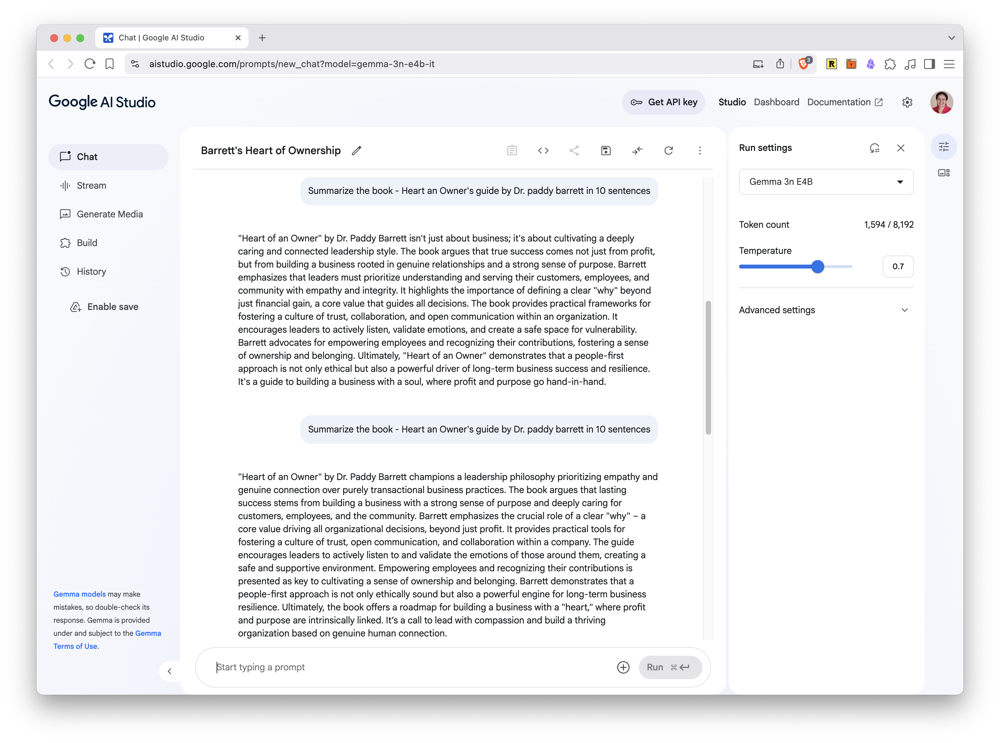
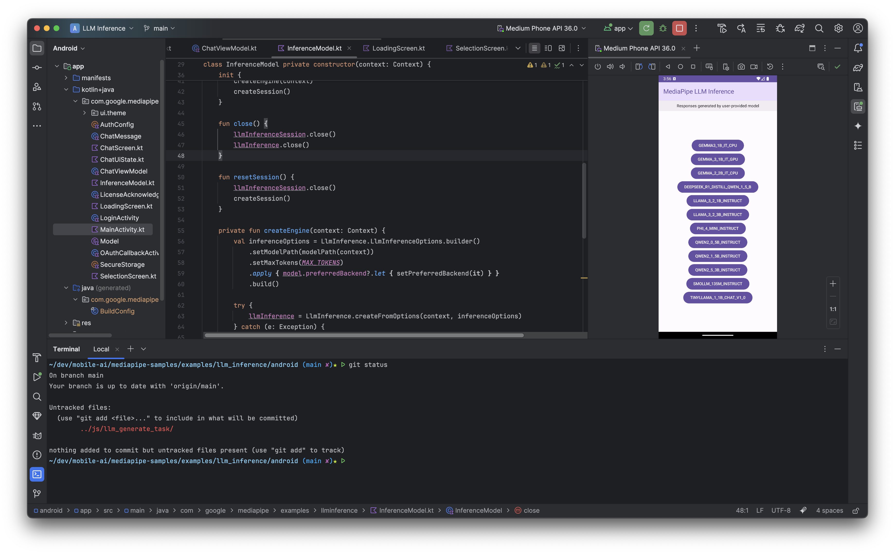

+++
title = "Mobile On-device AI: Smarter, Faster, and Private Apps"
description = "Comprehensive overview and hands-on guide to run AI models locally on your device"
date = "2025-05-31T13:13:12-07:00"
draft = false
tags = ["mobile", "AI"]
topics = ["tech-explorations", "on-device-ai", "edge-ai"]
+++

AI is reshaping how we live and work - thanks to significant advancements in model capabilities and computational power centered in cloud infrastructure. At the same time, the mobile devices we carry every day - our phones and tablets - are becoming increasingly powerful. As a developer who loves exploring AI and has built mobile apps, I am fascinated by the idea of these two worlds of **mobile and AI converging**. I believe there is immense potential in using this local device power for AI and building experiences that are more private, faster, and smarter. This conviction is what inspired me to write this post.

This post dives into **Mobile On-device AI**, which involves running AI computations directly on your smartphone or tablet, rather than relying on remote servers. It's a specialized area within the broader Edge AI landscape - a field focused on leveraging local device capabilities as well as nearby edge servers - which I explore more in the post [Edge AI Essentials](/post/edge-ai). Here, we'll specifically cover the **significance** of on-device AI for mobile, exploring compelling **use cases**, its unique **advantages and challenges** given device constraints, and the **key tools and frameworks** to build mobile apps with on-device AI. This includes device-optimized models and specific frameworks such as **Apple Core ML**, and **Google AI Edge** (which encompasses the foundational TensorFlow Lite). I’ll try to share practical insights and code samples to help you understand how it works.

Whether you're new to mobile or an experienced mobile developer, I hope this gives you a good overview, a solid foundation to get started, and inspires you to experiment with mobile on-device AI. If you find it useful, I’d love to hear from you - here in the comments, or on Bluesky (TBD) or LinkedIn (TBD). Your feedback will help shape follow-up posts with deeper technical dives into this exciting area.

## The Basics
**Mobile On-device AI** enables mobile devices like phones and tablets to run AI models locally. This approach eliminates the need to send data to the cloud; once a model is downloaded to the device, all processing happens directly on it, keeping your data private and potentially reducing operational costs. For example, consider how modern smartphone keyboards offer predictive text suggestions. An on-device AI model analyzes your typing patterns locally and offers relevant word completions in real-time, without sending your keystrokes to a server. This ensures your typing remains private and the suggestions appear instantly, even if you're offline.

Unlike **Cloud AI**, where your mobile device typically sends requests to remote servers for computation and then awaits the results, on-device AI keeps these processes entirely local. Managing such tasks directly on your phone can meet computing demands efficiently, safeguard sensitive user data, and potentially lower data usage and cloud service costs for both the user and the app provider.

### Advantages
- **Low latency:** Eliminates mobile network delays, providing immediate responses
- **Offline capability:** Enables functionality without Wi-Fi or cellular data on phones and tablets
- **Enhanced privacy:** Keeps sensitive user data on the personal device
- **Optimized model size:** Utilizes smaller models designed for efficient mobile storage
- **Reduced power consumption:** Features optimized models contributing to lower battery usage on mobile devices
- **Potential cost savings:** Reduces reliance on mobile data and cloud processing, potentially lowering user and app provider costs.

### Use Cases

- **Real-time translation:** Your phone can instantly translate text in messaging apps or signs viewed through your camera, all without needing an internet connection. On-device AI facilitates private and immediate communication across languages.

- **Advanced photo editing:** Smartphones now perform complex edits, such as removing objects or blurring backgrounds, directly on the device. This offers faster processing, enables offline editing, and keeps your memories private.

- **Intelligent keyboard features:** On-device AI powers smart keyboard suggestions, grammar checks, and predictive text. This improves typing speed and accuracy while ensuring your keystrokes remain on your phone.

### Challenges
- **Limited resources:** Mobile devices have constrained RAM, storage, and processing power compared to cloud servers
- **Battery consumption:** Adding more AI capabilities could potentially increase battery drain
- **Model size optimization:** AI models must be small and efficient enough for practical use in mobile applications
- **Device fragmentation:** Ensuring compatibility and consistent performance across diverse mobile devices and OS versions is complex
- **Model management & updates:** Efficiently managing and delivering model updates to user devices without disrupting user experience or consuming excessive data is challenging

### The Big Question: On-device AI or Cloud AI?

So, when it comes to building AI into your mobile app, should you go with on-device processing or stick with the cloud? Well, like so many things in software development (and life!), there's no single right answer – it's all about trade-offs.

With **mobile on-device AI**, you get great benefits like top-notch user privacy (since data stays on the phone), snappy responsiveness (no network lag!), and the ability for features to work even when offline. The catch is that you're working within the limits of the phone itself - its processing power, memory, and battery life.

On the other hand, **cloud-based AI** lets you tap into extremely powerful servers. This means you can run highly complex AI models and crunch massive datasets. But, for this to work, the user data has to travel over the internet, and the app needs a stable connection to function.

Think about a photo editing app with an AI feature that removes unwanted objects. Consider a photo editing app with AI-powered object removal. Processing this on-device ensures your photos remain private and the feature works offline. However, a cloud-based service might offer more sophisticated and faster object removal algorithms due to greater computational resources, but at the cost of uploading your images to a remote server.

This is where a **hybrid approach** often shines, leveraging the strengths of both. The heavy lifting of **training and fine-tuning sophisticated AI models can happen in the cloud**, where computational resources are abundant. Then, these powerful models can be **optimized and deployed to the mobile device for local inference**, delivering a responsive, private, and often offline experience. Let's explore how that on-device part works.

## A Look under the Hood

At its heart, mobile on-device AI is about running specially prepared AI models directly on your smartphone or tablet's own hardware. 

The journey begins with a standard AI model, typically trained on powerful cloud servers using large datasers. To make it suitable for mobile use, this model undergoes a crucial **optimization** process. Techniques such as **quantization** (reducing the numerical precision of the model's parameters) and **pruning** (removing less critical parts of the model) significantly shrink its size and reduce computational demands, making it efficient enough to run on a phone without draining the battery excessively or taking up too much storage. 

Next, this optimized model is then typically either bundled within an app when you install it or downloaded by the app to your device at a later point.

Once the model is on your device, an application can load it and use it to perform **inference**. This is where the model takes new, local data (eg: an image from your camera or text you're typing) and makes a prediction or decision right on your phone's processor (CPU, GPU, or a specialized Neural Processing Unit - NPU, if available). This is managed by on-device AI **frameworks** like Apple Core ML or Google AI Edge, which act as an efficient engine to execute these models. For example, when a smart keyboard suggests the next word, it's this local inference process at work, analyzing your recent typing to provide instant, private suggestions without needing an internet connection.

This hybrid approach - cloud for training, device for inference - is becoming increasingly common. A good example is the **smart reply feature** in many messaging apps. While the AI models that generate these quick suggestions are trained on vast datasets in the cloud, the actual analysis of your incoming messages and the generation of reply options often happen directly on your device, ensuring your conversations remain private and the suggestions appear instantly. 

It ensures the core "thinking" for immediate tasks happens self-contained on your device, delivering the speed, privacy, and offline functionality that make mobile on-device AI so compelling. Furthermore, these on-device models can still be occasionally updated from a central server, ensuring they improve over time while primarily operating locally.

## Models and Frameworks

Building mobile on-device AI applications primarily involves two key technological components: **optimized AI models** designed for device constraints, and the **specialized frameworks or runtimes** that execute these models efficiently. We'll explore these next.

### Models for On-device AI
At the heart of on-device AI are models optimized for smaller devices – efficient enough to fit within the memory and processing limits of smartphones, wearables, and IoT gadgets. When these are language models, they are often referred to as Small Language Models (SLMs). Some prominent models optimized for on-device AI are:

- [Gemini Nano](https://developer.android.com/ai/gemini-nano) - Google's flagship proprietary model that runs ML tasks on devices
- **Gemma 3n**: The latest iteration of the on-device version of the Gemma family of open-weights models, [announced at Google I/O 2025](https://ai.google.dev/gemma/docs/gemma-3n)

- [Gemma 3 and 2](https://huggingface.co/google/gemma-3-12b-it) - Google's stable open weights on-device model

- [Microsoft Phi](https://azure.microsoft.com/en-us/products/phi): A lightweight, open-source language model optimized for edge devices, developed by Microsoft

- [Mistral](https://mistral.ai/news/): A family of efficient, open-weight models designed for fast inference on resource-constrained hardware

### Gemini Nano vs. Gemma 3n
Prior to the announcement of Gemma 3n at Google I/O 2025, prominent models for on-device AI included earlier Gemma versions and Gemini Nano. Both are optimized for on-device AI, though they cater to different use cases and have distinct access models. Here is a comparison of two models side-by-side:

{{< pure_table
"Feature                 | Gemini Nano                                                                | Gemma 3n"
"Mobile Optimization | Highly optimized for resource-constrained devices (e.g., <4GB RAM devices) | Optimized for medium-tier devices (e.g., phones/tablets with 4-8GB RAM)"
"Device Support      | Wearables, IoT, low-end Android phones                                     | Android, iOS, tablets, laptops"
"Model Access        | Proprietary - Available via Android AICore/ML Kit GenAI APIs (restricted) | Open weights - available at Kaggle Model Hub or LiteRT HuggingFace community"
"Use Cases           | On-device AI features in Pixel devices, Google Messages Smart Reply  | Custom LLM apps, Cross-platform AI features, Local RAG implementations"
"Feasibility         | Limited to Google's integrated use cases                                     | Designed for broader developer access"

>}}

Links:
- [Kaggle Model Hub](https://www.kaggle.com/models/google/gemma)
- [LiteRT HuggingFace community](https://huggingface.co/collections/google/gemma-3n-preview-682ca41097a31e5ac804d57b)

Despite these differences, both these models are built on the same foundational architecture, so we will likely see more convergence of these models with differentiation in delivery and business models.

## Frameworks for On-device AI

Once you have an optimized AI model (like the ones discussed in the Models section above), you need a way to actually run it on a mobile device. This is where on-device AI frameworks and runtimes come into play. They provide the necessary engine and tools to efficiently execute these models, manage resources, and often interact with device hardware for acceleration. The two main players in the mobile ecosystem are:

*   **Google AI Edge:** Google's comprehensive suite for on-device AI - libraries, tools, and frameworks designed to deploy and run ML models directly on edge devices. Key components include:
    *   **LiteRT (formerly TensorFlow Lite):** A crucial open-source runtime for executing a wide range of optimized models, including Google's Gemma family and custom-trained models, on Android, iOS, and other platforms. You can choose a model for your use case, convert it to the LiteRT format, and run it on-device
    *   **MediaPipe:** Offers pre-built, customizable solutions for tasks like vision and audio processing, often leveraging LiteRT. You can choose the task that solves your AI/ML problem, and implement it on multiple platforms. If you intend to use MediaPipe Tasks, refer to the [MediaPipe Tasks documentation](https://ai.google.dev/edge/mediapipe/solutions/tasks)
    *   **ML Kit:** Provides easy-to-integrate APIs for common AI features, sometimes powered by models like Gemini Nano under the hood for specific functionalities within Google's ecosystem or via new GenAI APIs. See more info at [ML Kit docs](https://developers.google.com/ml-kit)

*   **Apple Core ML:** Apple's dedicated framework for running machine learning models efficiently and privately on iOS, macOS, and other Apple platforms. It works with models converted to its specific format and optimizes execution across Apple's CPU, GPU, and Neural Engine.

## Deep dive: Apple Core ML
Core ML is Apple’s framework for running machine learning models on iOS, macOS, tvOS, and watchOS devices. It is designed for on-device inference, minimizing memory footprint and power consumption while keeping data private. It leverages Apple silicon, including the CPU, GPU, and Neural Engine, to maximize speed and minimize memory footprint and power consumption.

It works with Vision (for image and video analysis), Natural Language (for text processing), and GameplayKit (for game AI). Models trained in TensorFlow, PyTorch, or other frameworks can be converted to Core ML format using Core ML Tools, making it straightforward to deploy existing models on Apple devices.

#### How CoreML works
- **Model Preparation:** ML models are trained on powerful computers and converted to the Core ML format (`.mlmodel`), optimized for Apple hardware - using [Core ML Tools](https://apple.github.io/coremltools/docs-guides/source/introductory-quickstart.html)
- **Integration:** The `.mlmodel` file is added to an Xcode project. Xcode automatically generates a Swift or Objective-C class for the model (`.mlmodelc`), providing type-safe access to inputs and outputs
- **Execution:** The app passes input data (e.g., images, text) to the model. Core ML dispatches computations to the most appropriate hardware (CPU, GPU, or Neural Engine) for efficient inference
- **Stateful Models:** Recent Core ML updates support stateful models (like those used in generative AI), managing state (such as key-value caches for language models) to improve efficiency and reduce overhead    
- **Performance Profiling:** You can can profile model performance, identify bottlenecks, and optimize models for specific hardware using tools in Xcode and Core ML Tools

Here is how you can use a model using Core ML in your app. Note - `.mlmodelc` is the compiled version of the model you imported into XCode.
``` swift
	guard let modelURL = Bundle.main.url(
                            forResource: "CoreMLTrainedModel", 
                            withExtension: "mlmodelc") else {
	    fatalError("Failed to locate the Core ML model file.")
	}
	do {
	    let model = try MLModel(contentsOf: modelURL)
	    // Now you have Core ML model object ready to make predictions
	} catch {
	    fatalError("Failed to create Core ML model object: \(error)")
	}
```

 After this, you prepare your input data so it matches the requirements of your model. This might involve resizing images, normalizing values, or encoding text. For example, you may need to resize an image to a specific dimension before passing it to the model. Then, pass the prepared input data to the model’s prediction method. The model will process the input and generate an output. Once you receive the model’s output, interpret and use it as needed in your app. Finally, display the results to the user.

Read more about it at [CoreML Quick Start Guide](https://apple.github.io/coremltools/docs-guides/source/introductory-quickstart.html).

## Deep dive: Gemma 3n
This is the latest open model optimized to run on mobile devices with at least 2GB RAM. It provides real-time AI on phones, tablets and laptops. It is in early preview and is available on Google AI Studio, Google AI Edge SDK and [LiteRT HuggingFace community](https://huggingface.co/collections/google/gemma-3n-preview-682ca41097a31e5ac804d57b). 

Gemma 3n can be deployed on mobile devices using the MediaPipe library of Google AI Edge SDK that we saw earlier. It is built on the same advanced architecture that powers **Gemini Nano**, the flagship mobile-optimized model. The development of Gemma 3n is a collaboration between Google DeepMind, Qualcomm, and Samsung, ensuring that it is engineered for high performance and efficiency across a wide range of mobile hardware.

> Gemma 3n is the mobile-optimized, multimodal model that enables developers to build mobile-first AI applications - everything runs locally.

### Key Features
- **Natively Multimodal:** Supports text, image, audio, and video inputs and outputs
- **Multi-Lingual:** Offers robust support for multiple languages - trained over 140 languages
- **Open Weights:** The model is available under open weights, encouraging community development and transparency
- **Realtime Capabilities:** Enables real-time transcription, translation, and voice interactions directly on device
- **Extended Context Length:** Supports a context window of up to 32K tokens, significant input length for complex and lengthy data
### Model variants
Two main variants are available in the preview:
1. **Gemma 3n E2B:** [HuggingFace Model Hub Link](https://huggingface.co/google/gemma-3n-E2B-it-litert-preview)
2. **Gemma 3n E4B:** [HuggingFace Model Hub Link](https://huggingface.co/google/gemma-3n-E4B-it-litert-preview)

For reference, the previous model **Gemma 3-1B** is available at https://huggingface.co/litert-community/Gemma3-1B-IT
### Naming is hard, but fun too!
There are a few subtle elements in the name of the Gemma models that are interesting to know.
- The **n** suffix in the model name refers to the *nano-sized* models in the Gemma family, specifically optimized for resource-constrained devices like mobile phones and wearables
- The **E** prefix in the Gemma 3n model names stands for the *Effective* parameter size, indicating the reduced, or effective, number of parameters the model actually needs to use during inference on a device, rather than the total parameter count stored in the model files. For example, the Gemma 3n E2B model contains 5 billion parameters, but it can operate with an effective memory footprint of 2B parameters because of the techniques like Per-Layer Embedding (PLE) caching and selective activation of parameters. Similarly the E4B model needs only 4B parameters to be active at run time even though it is a 8B parameter model.

LiteRT is the new name for *TensorFlowLite* - and it stands for *Lite RunTime*
### Architecture of Gemma 3n
There are a few important aspects of the new architecture that powers Gemma 3n and the Gemini Nano models.
- **PLE Caching:** PLE (Per-Layer Embedding) parameters are generated separately and cached in fast storage, then added during inference, reducing the memory footprint at runtime
- **Selective Parameter Activation:** The model can dynamically load only the parameters needed for the current task (e.g., text, image, or audio), further reducing resource use. The model with 4B active memory footprint embeds a nested state-of-the-art submodel with 2B active memory footprint. This allows the model to dynamically load the relevant submodel to balance performance and quality based on device capabilities, user query etc.
- **MatFormer Architecture:** This allows the model to nest smaller submodels within a larger one, so only the relevant submodel is activated per request, minimizing compute and memory requirements

### Hands-on: Gemma 3n

Ok, let’s roll up our sleeves and see these models in action. We can do that in a few places:

1. **Google AI Studio:** This is Google’s playground where you can try all their models in a chat-like interface. It’s the simplest way to see Gemma models, including the latest Gemma 3n.
2. **Sample apps from MediaPipe:** These are available for Android, iOS, and web browsers. They let you run models directly on your device or in the browser.
3. **Google AI Edge Gallery app:** This new app from Google AI Edge SDK lets you download and run models like Gemma 3n directly on your Android device, offline.

**Note:** The mobile setup is fairly easy. You don’t need advanced mobile expertise - just a compatible USB cable and the ability to follow instructions.

#### 1. Run Gemma 3n on Google AI Studio

This is the fastest way to try out Gemma 3n without any setup hassle. 
- Go to [Google AI Studio](https://aistudio.google.com/prompts/new_chat) and login with your Google account
- Select the **Gemma 3n 4B** model in the dropdown menu on the right. 
- Start chatting with the model right away. Adjust the parameters like temperature, TopP etc. as you wish.
- Other Gemma models are also available here. You can use any of them.

Here is a screenshot of Google AI Studio running Gemma 3n 4B. As you can see, the answer to my question about a new book on heart health didn't come out correctly. This is a limitation of smaller models.


#### 2. Run Gemma 3n on Android phone

We have two options to run Gemma models on Android:
##### 2.1 MediaPipe Sample App
This app demonstrates all supported Small Language Models (SLMs) like Gemma 2, Gemma 3, Microsoft Phi, and QWEN. It’s available on [GitHub: google-ai-edge/mediapipe-samples](https://github.com/google-ai-edge/mediapipe-samples).
    - **Drawbacks:** The sample app is minimal, somewhat outdated, and not as polished as newer offerings. Importantly, **you cannot run Gemma 3n models in this app**. Attempts to modify the source code to add Gemma 3n often result in errors like “Access denied. Please try again and grant the necessary permissions,” even after setting up permissions on Hugging Face. In my understanding, this suggests the app is explicitly restricted from running newer models.

Here are some screenshots of MediaPipe sample app running on my Pixel 8 Pro Android device:


And the sample app running in Adroid studio


##### 2.2 Google AI Edge Gallery App
This is a newer, more versatile sample app available as an experimental Alpha release. It’s sleek, easy to use, and demonstrates the full power of on-device AI. You can run Gemma 3n models (E2B and E4B) directly on your device, but not older models.    
    - **Download and instructions:** [GitHub: google-ai-edge/gallery](https://github.com/google-ai-edge/gallery)
    - **How it works:** After installing, select a model from the list (such as Gemma 3n E2B or E4B), and you can start using AI features like chat, image analysis, and more - all offline

Here are some screenshots of Gallery app running on my Pixel 8 Pro Android device - the home page that shows the tasks it supports, asking the user to review the license of Gemma 3n and downloading the Gemma 3n model:



The gallery app supports three three main type of tasks - Chat, Explain Image and Summarize.


See detailed instructions for each app:
- **MediaPipe Sample App:** [MediaPipe Samples GitHub](https://github.com/google-ai-edge/mediapipe-samples)
- **Gallery App:** [Google AI Edge Gallery GitHub](https://github.com/google-ai-edge/gallery)
In summary, use the old MediaPipe sample app to run models prior to Gemma 3n, and the new Gallery app to run Gemma 3n models. Google may consolidate these apps in the future or deprecate older models.

#### 3. Run Gemma 3n on iOS phone
**The new Google AI Edge Gallery app is not yet available for iOS - its release is marked as “coming soon.”**  
Currently, our only option is to use the old MediaPipe sample app, which supports models prior to Gemma 3n (like Gemma 2 and Gemma 3).

The LLM Inference API from MediaPipe enables you to run large language models (LLMs) entirely on-device for iOS applications. This allows you to perform advanced AI tasks such as text generation, information retrieval, and document summarization - all while keeping user data private and secure.

**How to get started:**

1. **Install the MediaPipeTasksGenai library**  - Add the necessary dependencies to your project using CocoaPods. Add the following to your `Podfile`:
```ruby
target 'MyLlmInferenceApp' do
  use_frameworks!
  pod 'MediaPipeTasksGenAI'
  pod 'MediaPipeTasksGenAIC'
end
```
Note - The library is compatible with both Swift and Objective-C apps and does not require any additional language-specific setup.

2. **Download a compatible model**   - Download a supported model (such as Gemma-2 2B in 8-bit quantized format) from Kaggle Models. Add the model file to your Xcode project.
    
3. **Initialize the LLM Inference task**  - Configure the task with your model path and desired options:
```swift
import MediaPipeTasksGenai

let modelPath = Bundle.main.path(forResource: "model", ofType: "bin")
let options = LlmInferenceOptions()
options.baseOptions.modelPath = modelPath
options.maxTokens = 1000
options.topk = 40
options.temperature = 0.8
options.randomSeed = 101
let llmInference = try LlmInference(options: options)
```
    
4. **Run the task and generate responses**  - Use the `generateResponse(inputText:)` method for single responses, or `generateResponseAsync(inputText:)` for streaming:
``` swift
let result = try LlmInference.generateResponse(inputText: inputPrompt)
// For streaming:
let resultStream = LlmInference.generateResponseAsync(inputText: inputPrompt)
do {
  for try await partialResult in resultStream {
    print("\(partialResult)")
  }
} catch {
  print("Response error: \(error)")
}
```
    
5. **More configuration** - You can adjust the model parameters like **maxTokens**, **topk**, **temperature**, **randomSeed** and path to the model file as **modelPath**
6. **Sample application** - The [MediaPipe Samples GitHub repository](https://github.com/google-ai-edge/mediapipe-samples) includes a sample iOS app that demonstrates how to use the LLM Inference API. Clone the repository and open the project in Xcode to see it in action.

The API also supports LoRA (Low-Rank Adaptation) for efficient fine-tuning of models, allowing you to customize model behavior for specific tasks.

For detailed instructions and advanced setup, see the official documentation: [MediaPipe LLM Inference API for iOS](https://ai.google.dev/edge/mediapipe/solutions/genai/llm_inference/ios)

#### 4. Run Gemma 3n on mobile browsers
You can run Gemma and other large language models directly in your browser using the MediaPipe LLM Inference API for JavaScript. This allows you to perform advanced AI tasks - such as text generation, information retrieval, and document summarization - entirely on-device, without sending data to a server.

**Supported Models**
- **Gemma-2 2B**, **Gemma-3 1B**, and other models like Phi-2 and StableLM are supported.
- **Gemma 3n (E2B, E4B)** is not currently listed as supported for the Web API.

It is fascinating to see the model loaded into the browser on your machine. Of course, tools like Ollama does the same, but it feels different when you see that happen in the context of a browser - which you usually think of as a lightweight window to the world wide web.

**Setup instructions**
- **Install the package:**
```bash
    npm install @mediapipe/tasks-genai
```
Or use the CDN:
```xml
	<script 
        src="https://cdn.jsdelivr.net/npm/@mediapipe/tasks-genai/genai_bundle.cjs" 
        crossorigin="anonymous">
    </script>
```
- **Download a model:**  For example, download Gemma-2 2B in 8-bit quantized format from Kaggle Models or HuggingFace LiteRT and place it in your project directory.
        
- **Initialize the task:**
``` javascript
    const genai = await FilesetResolver.forGenAiTasks(
	  "https://cdn.jsdelivr.net/npm/@mediapipe/tasks-genai@latest/wasm"
	);
	llmInference = await LlmInference.createFromOptions(genai, {
	  baseOptions: { modelAssetPath: '/assets/gemma-2b-it-gpu-int8.bin' },
	  maxTokens: 1000,
	  topK: 40,
	  temperature: 0.8,
	  randomSeed: 101
	});
```
- **Run inference:**
```javascript
	const response = await llmInference.generateResponse(inputPrompt);
```
Or stream the output:
```javascript
	llmInference.generateResponse(
        inputPrompt,
        (partialResult, done) => {
            document.getElementById('output').textContent += partialResult;
        }
    );
```
        
- **Browser Compatibility** - Requires WebGPU support. Check the [GPU browser compatibility](https://ai.google.dev/edge/mediapipe/solutions/genai/llm_inference/web_js#gpu_browser_compatibility) page for details.
- **LoRA (Low-Rank Adaptation)** - You can fine-tune models using LoRA and load custom LoRA weights at runtime for specialized tasks.
        
See detailed instructions: [MediaPipe LLM Inference API for Web](https://ai.google.dev/edge/mediapipe/solutions/genai/llm_inference/web_js)

### Cross platform summary
The following table summarizes how to run the model on various platforms.



## References
**Google On-Device AI & Models:**
*   Announcement of Gemma 3n at Google I/O 2025: [Google Developers Blog: Introducing Gemma 3n](https://developers.googleblog.com/en/introducing-gemma-3n/)
*   Google AI Guide for Android: [developer.android.com/ai/overview](https://developer.android.com/ai/overview)
*   Gemini Nano for Android: [developer.android.com/ai/gemini-nano](https://developer.android.com/ai/gemini-nano)
*   Gemma Models Official Page: [ai.google.dev/gemma](https://ai.google.dev/gemma)
*   TensorFlow Lite Guides: [tensorflow.org/lite/guide](https://www.tensorflow.org/lite/guide)
*   ML Kit: [developers.google.com/ml-kit](https://developers.google.com/ml-kit)
*   MediaPipe Solutions: [ai.google.dev/edge/mediapipe/solutions](https://ai.google.dev/edge/mediapipe/solutions)

**Apple On-Device AI:**
*   Core ML Overview: [developer.apple.com/documentation/coreml](https://developer.apple.com/documentation/coreml)
*   Core ML Tools (for model conversion): [apple.github.io/coremltools](https://apple.github.io/coremltools/docs-guides/source/introductory-quickstart.html) (Your link is good)

**Other Key Models & Platforms:**
*   Microsoft Phi Models (Example on Hugging Face): [huggingface.co/microsoft/phi-2](https://huggingface.co/microsoft/phi-2)
*   Mistral AI: [mistral.ai](https://mistral.ai/)
*   Hugging Face Model Hub: [huggingface.co/models](https://huggingface.co/models)