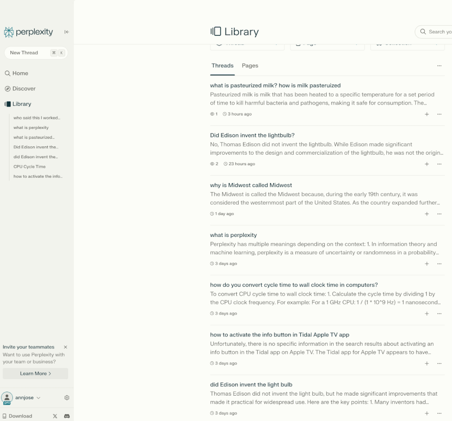

+++
title = "Perplexity AI: A Deep Dive"
description = "A new way of discovering information through Perplexity AI"
date = "2024-06-27T16:19:12-07:00"
draft = false
tags = ["AI", "tech-explorations", "generative-ai", "LLM", "machine-learning"]
topics = []
+++

**Perplexity AI** (https://www.perplexity.ai) has been gaining attention in the world of chatbots and large language models. I had heard about it in a few forums and mentioned by industry leaders like Jensen Huang and Kelsey Hightower. In fact, I had created an account and tried it out a few times earlier this year, but didn't take it much seriously. 

All that changed last week when I watched [this recent interview](https://www.youtube.com/watch?v=e-gwvmhyU7A) of Perplexity CEO [Aravind Srinivas](https://www.linkedin.com/in/aravind-srinivas-16051987/) by [Lex Fridman](https://www.linkedin.com/in/lexfridman/). It is a [fascinating interview](https://www.youtube.com/watch?v=e-gwvmhyU7A) - highly recommended for everyone to watch, but personally, it opened my eyes to the fact that Perplexity is very different from other chatbots, not only in how it works, but what it is trying to solve. So I started using it for a few days and was blown away by the results 💯. I realized that this is one of the tools that gives you so much value that you cannot imagine going back to the way of doing it. 

In this post, I would like to share my thoughts on Perplexity - the good and bad - as well as a few interesting insights from the interview with Aravind. All of this information from my own personal experience, and not copy-pasted or generated from some documents.

## About Perplexity
Perplexity is an AI search (answer) engine that answers questions only based on **factual, real-time data** retrieved from trusted sources. Every answer it returns has the relevant sources as citations. When you ask a question, it doesn't give you a bunch of links like Google does, nor does it give just a potentially unreliable answer like most of the LLMs. Instead, it gives a concise answer based on grounded factual truth along with the links to the sources of that answer so that you can do the fact checking yourself.

### How does it work?
It uses the fundamental principles of RAG (Retrieval Augemented Query) where in given a query, it retrieves the relevant documents and extracts the relevant paragraphs from those documents and uses this information to craft a clear concise answer along with the citations of the sources. But it goes much further than RAG. While RAG which adds the information from the relevant documents to the context and sends it as context to an LLM to generate the answer, Perplexity sticks to the ground truth only and follows the principle that you are not supposed to say anything that you didn't retrieve. So if it doesn't have enough information to give an answer, it would say so rather than cooking up some information generated by an LLM. Sure, it uses LLMs to craft the answer, but not to generate it. This is very powerful and reduces the impact of hallucination.

They have a Search component which focuses on retrieval and an LLM component that focuses on writing the answer. They have trained their own model *Sonar Large 32K*, based on LLaMA 70B fine tuned for specific skills like referencing citations, summarization etc. It also works with the frontier models like GPT-4o, Claude Sonnet, Claude Opus (for which you need the Pro subscription). Thus they are model agnostic.

Under the hood, it uses language models to understand the context of the question, then searches the web for accurate up-to-date information, gives the relevant results to LLM which in turn crafts the answer in a comprehensive concise way along with the citations.

## My use cases
All tools come to life when we use it for our own purposes. Here are a few use cases where I found Perplexity to be useful. Some of these may be more detailed than needed, but I hope it will help you appreciate how the tools adds value in day to day life, vs. hypothetical scenarios.

1. **Understand concepts deeply** - As part of a book club shared in HN, I am reading the book **Understanding Software Dynamics** by Richard Sites, a fantastic book about performance debugging that goes deep into CS concepts of microprocessors, memory, hard disk, network. As a Math (not CS) major, I only have a shallow knowledge of these concepts. So I realized that unless I understand these concepts really well, I cannot understand or appreciate the crux of the book. And I have the time at hand to learn what I want, so it is the perfect opportunity to learn this too. 

    So I started reading the book with Perplexity by my side. Whenever I encountered a concept that I don't fully understand (eg: CPU clock cycle, instruction fetching etc.), I would ask what it is and got a detailed, yet succinct answer with at least 5 credible references. Not only did this help me understand the concept, it also motivated me to go to the references and dive deeper as needed. I would keep doing this over and over until I understand the fundamental of each chapter. Initially this was very slow as I cross reference between the book and Perplexity, but very soon I could see myself getting more and more comfortable with challenging concepts. It is expanding my knowledge and helps me derive more knowledge from the book, which in turn expands my knowledge of application performance.

2. **Expand your knowledge** A few months ago, I started making home made yoghurt and made a routine of making it every other week. The process is very simple with three main steps - 1) boil the milk to 195F for 10 minutes, 2) cool it down to 110F and 3) keep it in the proofing box at 115 for an hour and then 86F for 4 hours. It is mostly a hands-off process except for Step (1) where I need to wait until the milk cools down from 190 F to 110 F. In my understanding, the purpose of this step is to kill the bad bacteria so that good bacteria can ferment the milk at 110 F. This sounds vaguely familiar to milk pasteurization, so I wanted to know what it does and if I use pasteurized milk, can I skip the Step 1 and the asociated wait time? Well, only one way to find out. ask Perplexity. So I did and got a decent explanation of what pasteurization does, the two types of pasteurization (High Temperature Short Time, Ultra etc) and *Pasteurization is crucial for food safety, as it eliminates harmful bacteria such as E. coli, Salmonella, Listeria, and Campylobacter that may be present in raw milk*.

    I went one step further and asked - my yoghut recipe involves a step to heat the milk to 195 F for 10 minutes. If I use pasteurized milk, can I skip that step and go directly to Step 2? It replied *Heating milk to 195°F (90.5°C) for 10 minutes isn't just about killing bacteria. This step also denatures the proteins in the milk, particularly whey proteins. This denaturation is crucial for creating a thicker, more stable yogurt texture. The heating process also evaporates some water, concentrating the milk slightly, which contributes to a thicker final product.* Pretty useful! This is the [link to the full answer](https://www.perplexity.ai/search/what-is-pasteurized-yBUboZ8cQRuJLI1lxf3Q2w).

3. **Discover credible sources** For every answer, Perplexity shows a list of *related questions* to know more about that topic or the answer. They show these questions in the Home page as well. And yes, this is rabbit hole waiting for me, 😎. But I love going down that path and learn a bunch of interesting information - may not be particularly 'useful'. For example, one question was *did Edison discover the light bulb* - I had some vague memory of an unconventional answer, but Perplexity's response made it clear to me. 

    The best part was that one of the references in the answer was an [article from Britannica](https://www.britannica.com/video/226779/did-you-know-who-invented-the-light-bulb) which also had a good video about who really invented the lightbulb. It made me realize that it's been a long time since I saw the Britannica website. Searching for things in Google hardly bring up these links.

4. **Writing code** - I had to write C code to implement the exercises in the book. The last time I wrote C code was in 2010!. So I sought help from Perplexity and it worked out very well. The results were pretty much comparable to ChatGPT, however, I felt Perplexity's answers were more concise and to the point. However, I think GitHub Copilot is is the hero in this area and will be for the near future.

5. **It says I don't know** - I asked how to activate the Info button in the Tidal app on Apple TV. And it answered *Unfortunately, there is no specific information in the search results about activating an info button in the Tidal app on Apple TV. The Tidal app for Apple TV appears to have limited functionality compared to other platforms.* Yes! when you don't find a result, say it so, instead of making up a stupid answer or giving a bunch of irrelevant search results just to keep me 'engaged'. Perplexity got this right!

6. **General questions** - You can ask regular general questions like 'suggest a few good bathroom fixture stores near San Jose', 'why is Midwest called Midwest', 'can you play Scrabble with yourself', 'how important is data alignment in terms of performance' and met questions like 'what is perplexity'  - I told you it takes you down rabbit holes :)

## More goodness
After using it multiple times a day for more than a week, I see that the answers given by Perplexity are more dependable than many other AI models including ChatGPT or Gemini. The main reason for that is the answers come with the citations, so I could always go to the source and verify.

They have a mobile app too, which works really well - the erstwhile mobile developer in me is happy. I use it quite often.

With their Pro account, you can create Pages, where you can share your thread (your conversational queries and answers) with others. The page is automatically created for you and you can publish it along with all the references and images if you wish. For example, I had a thread with a lot of questions about CPU cycle and the answers solidified my understanding. So I converted it to a page and published it as [CPU Cycle Time](https://www.perplexity.ai/page/CPU-cycle-time-0vTp2.GVSr.hwzGbF.XS_A). 

I found this feature fascinating because this 'article' is unique to me, but also useful for others who may want to learn about the same topic. They can also see my learning path. The best part is that - it is so easy to do, a natural progression of what I was doing.

## Less goodness
Like everything in the world, there are certain things that I don't like about Perplexity.

First, I am 'perplexed' by the UI information architecture of pages and threads. When you click on [Library button](https://www.perplexity.ai/library) on the left, it shows page with a top level menu with buttons to create  a thread / page / collection and there is another tab with 'Thread' and Pages where you can see the threads and pages that are saved. If you click on any page or thread, it opens that content in almost full screen, so you don't see the top menu or the tab any more. So if you want to see another page/thread, you need to go to Library, the tab and then select the page/thread. It would be great if I don't lose the context like this, so you could show the menu and tab somewhere on the left or right, so that I can get it to again. 

I got quirky answers to some questions. For example, one of the sample queries in the Home page was *Penalty for late tax filing*. The answer to this prompt was about income tax filing in India, not the US where I live. While it could have been more personalized, I want to caution from going too far on that direction - no, I don't want to see ads of Scrabble or bathroom fixtures wherever I go. It is a balance.

The workflow to create an account was confusing to me - when I gave my email address, it sent me the magic link, which worked well. But when I clicked on it, it showed me the page to sign up for the Pro account, that too as a full page modal which seemed to be indismissable. So I signed up for the Pro account so that I can get into the app. But then when I read the FAQ, it feels that I can do everything I need with non-Pro account. I wish the benefits of the Pro account was more clearly laid out in the modal, or have a subtext that 'you can do this later'.

Finally, there are ongoing controversies about [Perplexity Bot using not honoring robots.txt or proper user agents](https://rknight.me/blog/perplexity-ai-is-lying-about-its-user-agent/) and the recent [clash with Forbes on potential plagiarism in Perplexity Pages](https://x.com/JohnPaczkowski/status/1799135156051255799). 

## Screenshots

## The Interview

As I mentioned in the beginning, my deeper exploration of Perplexity was inspired by the interview of their CEO. In this long (three hours!) long interview, Aravind talked about the major breakthroughs in AI that brought us to LLMs, the mission of Perplexity, how the technology works, his vision of the future of search and web in general, and some valuable advice for startup founders and young people. 

All the while I  was using this tool, I would think back to the interview and realized that there are a lot of great nuggets that I need to write down. I did that, but the list is too long to fit into this post. So I wrote them in a separate post here - [Inside Perplexity AI: Insights from the CEO Aravind Srinivas](/post/perplexity-ai-ceo-interview/). Hope you will enjoy the read!
 
## Conclusion
As of now, my verdict about Perplexity is that it is reliable and useful to discover new information and increase our understanding. It seems to be living up to the promise of being a tool to discover knowledge. At the end of the day, it also comes down to how they do it, including how they handle the controversies mentioned above. So if (and that is a big if) they do it right, this could revolutionize the way we discover knowledge. 

I wish all the best to the team at Perplexity so that they can make a positive change in how we discover information and that too, do it the right way. Please don't take shortcuts, don't disrespect the privacy of people and definitely don't make this an ad business.