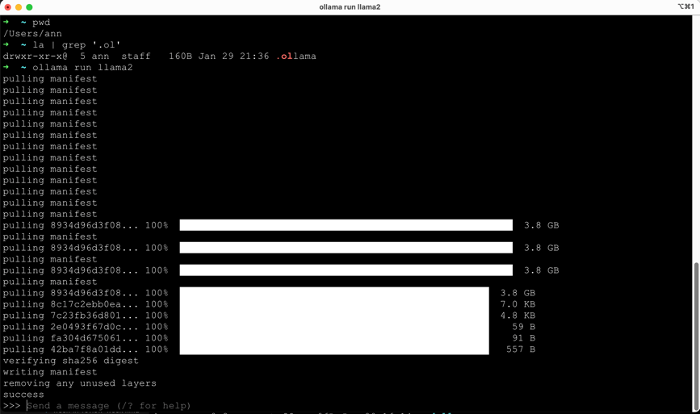

+++
title = "Run Code Llama 70B locally"
description = "Testing out Meta's new model Code Llama 70B"
date = "2024-01-29T16:42:25-07:00"
draft = false
tags = ["llm", "tech-explorations", "how-to", "generative-ai"]
topics = []
+++

Today, [Meta AI announced](https://twitter.com/AIatMeta/status/1752013879532782075) they are releasing a new model **Code Llama 70B**, a higher performing LLM to generate code. This was exciting news and we have to try it out immediately.

In this post, I will do a walk-through of how to download and use the new model and how it compares to other code generating models like GPT-4.

As usual, the best way to run the inference on any model locally is to run [Ollama](https://ollama.ai/). So let's set up Ollama first.

## How to install and run Ollama
- Download Ollama app from [Download page](https://ollama.ai/download). If will download the app - if you are on Mac, OS, this will be a 170MB file **ollama-darwin.zip**.
- Extract the contents of the zip file. You will get the file **ollama.app**
- Ollama recommends that the above app file be moved to **Applications** folder. If you try torun it from any other folder, it will show it will show a popup that says the exact same thing. So let's just follow the recommendation and move it to Applications folder.
- Double-click `ollama.app`. It will ask for confirmation to install command. Accept this.

Open the terminal and run `ollama run llama2`. It will start downloading the models and the manifest files to a hidden folder `.ollama`. 
Note - Ollama does not consider the folder in which the command is run. Irrespective of the current folder, Ollama will always create this hidden folder inside the home folder `~`.

When the model download is complete, Ollama will show a prompt at the terminal. Here you can ask any question here and it will answer.

Anytime you want to exit the prompt, press `Ctrl+Z`.



### Side quest - Folder structure of .ollama
Let's take a moment to see what is inside the `.ollama` folder.

``` sh
- .ollama
  |- models
    |- blobs
        |- (model files sha256 hash signature) 
    |- manifests
        |- registry.ollama.ai
            |- library
                |- llama2
                |- codellama
```

### Troubleshooting Issues
You may encounter one of these issues while running the models.

**Symptom**: when you run the model through ollama, it throws the error *Error: invalid character '}' looking for beginning of object key string*

**Reason**: it means that the manifest file is corrupt. 

**Solution**: restore the manifest file using Ollama itself. Delete the manifest file and run ollama again as follows (remember to replace <model_name> with the actual model name).

``` sh
rm ~/.ollama/models/manifests/registry.ollama.ai/library/<model_name>` 
ollama run codellama:70b
```

Note - running the command again will NOT download the full model again. It will download only the manifest file.

## How to run the Code LLama 70B model
Assuming that you have done the initial set up described in How to install and run Ollama, run the following command. This will start downloading the Code LLama 70B model and run it just as it did for llama-2 model above.
``` sh 
ollama run codellama:70b

```

Now let's give it a prompt and see the results.

### Prompt
*Write a python script to show the first 20 numbers in fibonacci sequence*

### Result from Code Llama Code 70B model - Attempt 1 of 2 

In the first attempt, Llama Code 70B generated the following code: 

``` python{hl_lines=5}
Here is a simple Python script that generates the first 20 numbers of the Fibonacci series:

def generate_fibonacci(num):
    # Initialize the array with the starting elements of the fibonacci series.
    fib = [1, 1]

    for i in range(num - 2):  # Subtracting 2 because we have already added 2 elements.
        next_element = fib[i] + fib[i+1]
        fib.append(next_element)

    return fib

# Call the function with the number of elements you want to generate.
fibonacci_series = generate_fibonacci(20)
print(fibonacci_series)


This code initializes an array with the first two numbers of the Fibonacci series: 1 and 1.
Then, it iterates through a loop to calculate the next element by adding the current element
and the previous element. The newly calculated element is added to the end of the list.
Finally, it returns the Fibonacci sequence up until the specified number of elements.
```

#### Program output of of the code written by CodeLlama - Attempt 1 of 2
The above code was run through [PYNative Online Python Editor](https://pynative.com/online-python-code-editor-to-execute-python-code/) and it gave the following output:

``` sh{linenos=false}
    The first 20 numbers of the Fibonacci sequence are:
    [1, 1, 2, 3, 5, 8, 13, 21, 34, 55, 89, 144, 233, 377, 610, 987, 1597, 2584, 4181, 6765]
```

As you can see here, the output shows the Fibonacci sequence starting with 1, which is wrong. The [sequence should start from 0](https://en.wikipedia.org/wiki/Fibonacci_sequence).

Let's give it one more chance and make another attempt with the same prompt.

### Result from Code Llama 70B model - Attempt 2 of 2 
In the second attempt, Llama Code 70B generated the following code: 

``` python
def generate_fibonacci(n):
    """Generate and print the first n numbers of the Fibonacci sequence.

    Args:
        n (int): The number of numbers to generate from the Fibonacci sequence.
    Returns:
        None
    """
    # Initialize a list to store the sequence
    fib_sequence = [0, 1]

    # Generate the Fibonacci sequence up to n-th term
    for i in range(2, n):
        next_term = fib_sequence[i-1] + fib_sequence[i-2]
        fib_sequence.append(next_term)

    # Print the sequence
    print("The first", n, "numbers of the Fibonacci sequence are:")
    for i in range(n):
        print(fib_sequence[i], end=" ")

generate_fibonacci(20)  # Generate the first 20 numbers of the Fibonacci sequence
```

#### Program output of of the code written by CodeLlama - Attempt 2 of 2
Output of this program from the [PYNative Online Python Editor](https://pynative.com/online-python-code-editor-to-execute-python-code/) was:

``` sh{linenos=false}

    [0, 1, 1, 2, 3, 5, 8, 13, 21, 34, 55, 89, 144, 233, 377, 610, 987, 1597, 2584, 4181]
```

OK! Now the sequence is correct - starting from 0 as expected. Second time is a charm, yeah?

Now let's see how this compares to the result from ChatGPT using GPT-4.

## Result from ChatGPT with GPT-4

The prompt is the same as earlier:
*Write a python script to show the first 20 numbers in fibonacci sequence*

Given the prompt, ChatGPT first showed the output of the program as follows:

``` sh{linenos=false}

    Here are the first 20 numbers in the Fibonacci sequence:
    0, 1, 1, 2, 3, 5, 8, 13, 21, 34, 55, 89, 144, 233, 377, 610, 987, 1597, 2584, 4181 ​
```

Then it showed the code as follows:

``` python {linenos=true,hl_lines=5}
# Python script to display the first 20 numbers in the Fibonacci series

def fibonacci_series(n):
    # Initialize the first two Fibonacci numbers
    fib_series = [0, 1]
    
    # Generate the Fibonacci series up to n numbers
    for i in range(2, n):
        next_number = fib_series[-1] + fib_series[-2]
        fib_series.append(next_number)
    
    return fib_series

# Display the first 20 numbers in the Fibonacci series
fibonacci_first_20 = fibonacci_series(20)
fibonacci_first_20
```

#### Program output of of the code generate by ChatGPT/GPT-4

Output of this program from the [PYNative Online Python Editor](https://pynative.com/online-python-code-editor-to-execute-python-code/) was:

``` sh{linenos=false}

    [0, 1, 1, 2, 3, 5, 8, 13, 21, 34, 55, 89, 144, 233, 377, 610, 987, 1597, 2584, 4181]
```

## Summary
The code generated by LLama Code model was not accurate at the first attempt (it started the series from 0 instead of 1). It got it right in the second attempt. 
The code generated by GPT-4 was correct in that the sequence started from 0.

CodeLlama is at a good start, needs more work. I will continue to explore this model further.
