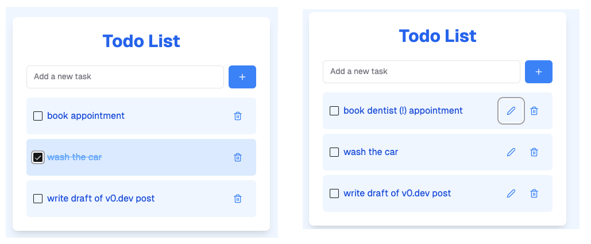
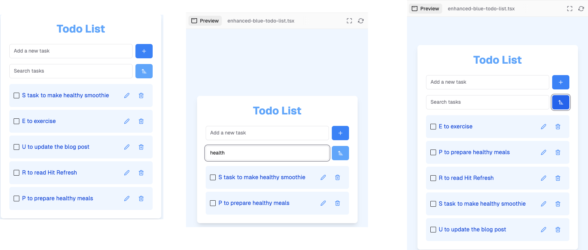
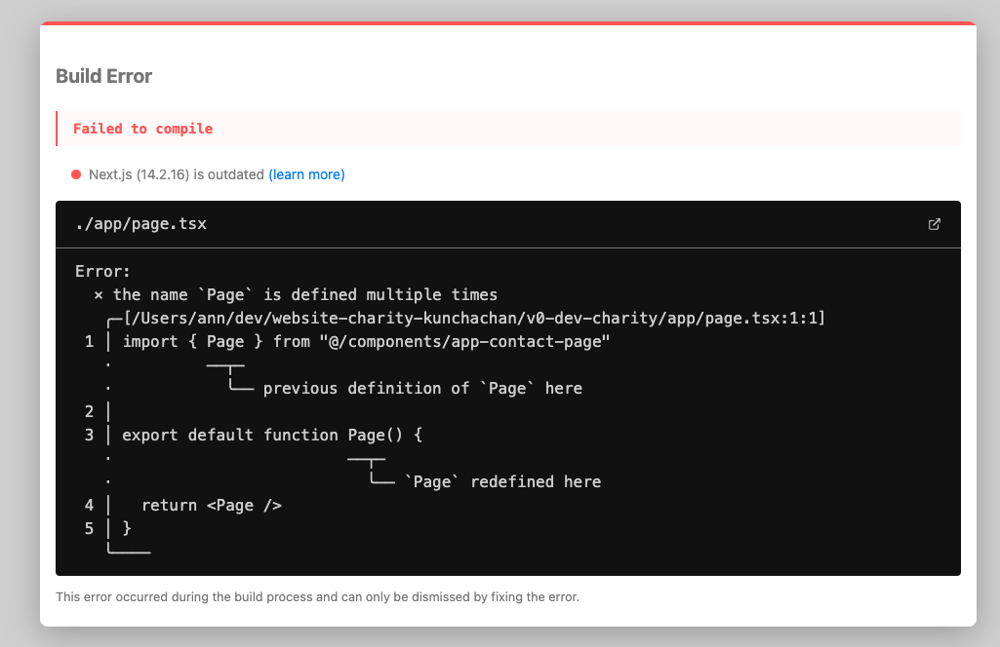

+++
title = "Vercel v0.dev: A hands-on review"
description = "Exploring the AI-powered web application builder"
date = "2024-11-04T15:54:13-07:00"
draft = false
tags = ["how-to", "web-development"]
topics = []
+++

I have been using many [Vercel](https://vercel.com/home) products in my web projects - for example, their [Next.js app framework](https://nextjs.org/), [deployment infrastructure](https://vercel.com/docs/deployments/overview) and [Vercel AI SDK](https://sdk.vercel.ai/). I love these tools because are easy to use and onboard, they are reliable and fast - and most of them are open source, which is fantastic ❤️. 

Their latest innovation is [v0.dev](https://vercel.com/ai), an AI-powered tool that helps you build frontend applications using a conversational chat interface. When I first heard about it, I thought it would be just another AI coding tool with a chat interface, similar to asking ChatGPT or Claude to generate code. However, [v0.dev recently announced a major update](https://x.com/v0/status/1826020673908535325) that includes integration with the popular [shadcn](https://ui.shadcn.com/) UI components and the ability to pull in external npm packages. So I decided to try it out yesterday.

The experience was mind blowing. In just an hour, I was able to build a functional, good-looking website using v0.dev's chat interface. It felt like magic - a series of "jaw-drop" moments. I was so excited that when George got home from work, I ran downstairs to rave about how awesome the tool was. Fun fact -  he had already tried it out and was thoroughly impressed, just in a subdued way than my excited reaction 🙂.

Now in this post, I'll give a brief [introduction of what v0.dev](#what-is-v0.dev), share [my firsthand experience](#my-firsthand-experience) of using it - what I loved about it, a few quirks I found while using it, and what I wish the tool could do better. Most importantly, I'll [discuss what I believe v0.dev means](#final-thoughts) for developers, designers, entrepreneurs, and anyone *using* the web.

If you've read this far and are thinking this is some crazy tech stuff and it's not relevant to you, I urge you to read the last section [Final Thoughts](#final-thoughts), There, I explain how this tool can (sorry if this sounds cliché) transform your own abilities (or perceived lack thereof) to build any website. Whether you are a developer, designer, product manager or just anyone who has dreamed of creating a website on your own, you'll see how v0 makes it possible. Perhaps that will convince you to come back and read the next section, which explains what v0.dev is and what you can do with it.

## What is v0.dev? {#what-is-v0.dev}
v0.dev is a chat-based website builder that generates code using modern web technologies like Next.js, React, Tailwind CSS, and shadcn UI components. It uses AI to generate interactive web pages with minimal effort, all within your browser. You can preview, modify and seamlessly deploy these pages to the cloud. Let's explore a simple exercise to see this tool in action.

### A simple example to get started {#get-started}
Visit [https://v0.dev](https://v0.dev) and give a simple prompt - *create a todo list app with blue theme*. It will generate a 'To Do List' page and display it in the App preview on the right side. In this fully interactive page, you can add, view and delete tasks. The page is built using using React, Tailwind CSS and TypeScript. You can switch to the Code mode to view the clean, modern code behind it.

From here, you can modify the page simply through prompts in the chat interface - all within your browser. For example, you can say 'implement edit feature where i can edit the tasks in the list' and it will generate an updated version of the code that implements the UI and logic for the Edit feature. You can play around this and test it out.

Here is the first two versions of our app:


You can have more fun with it by 'talking' to it in plain English, for example,
> *the blue in the heading is too dark, make it lighter, more pleasing to the eye. also add a search and sort features - i want to sort the tasks alphabetically*

It will update the page and the code with all these changes in just a few seconds. Impressive, right? I was also impressed by the quality of the generated code - neatly organized and following the best practices of TypeScript, React and Tailwind.

Here is the final variation of our app:


### Wait a minute, isn't this what ChatGPT or Claude does?
Yes, to a small extent, as both these tools give a chat based interface to generate and execute code. However, v0 does beyond that.

First, it uses the most up-to-date information of Next.js, including features from experimental releases, as v0 is fine-tuned with the latest knowledge of the framework. As an example, if you ask ChatGPT to 'create a Next.js form', it generates code using the client side form submission paradigm instead of the Next.js best practice of server actions. Similarly, that code would use the Pages router instead of the newer, improved App router paradigm, which is now the de facto way of building Next.js apps.

v0 takes it even further - which was my biggest "Wow! "moment - by creating a Next.js project out-of-the-box. With the same prompt as above, ChatGPT would give you step-by-step instructions on how to create a Next.js project, install Tailwind, create a component, run the application etc. But v0 will literally do all of this for you. It gives you a complete project that you can download, open in your favorite IDE and run - all out-of-the-box. See more details about it in the next section.

## What all can v0.dev do? {#what-it-can-do}

We will split this into two parts - the basics and the advanced - just for better readability and understanding.

### What can it do - The basics

v0.dev is a complete solution to build web applications.

* You can also **share your work** with someone - click the 'Share' button and click 'Public with link'. It creates a link with the full chat interaction along with the code and the preview is. Here is the [chat for the todo app](https://v0.dev/chat/80LiwrGXZ7h?b=b_qrkTSdrxhBG) that we created above.

* You can **publish the website** with someone - click the 'Share' button at the top and go to the Publish section. Here, the chat remains private, but the website is public. For example, here is the published page of the todo app - [https://b_qrktsdrxhbg.v0.build/](https://b_qrktsdrxhbg.v0.build/). It is a fully functional app published on cloud - go ahead and try it out!

* If you have a website that you love and wants to be used as an inspiration for the site that you are building, you can simply give the site's URL (or just a screenshot of it) in the chat prompt and ask it to create a site using this as an inspiration. I tried this with my own website and it worked great.

* v0 can **create a Next.js project** from the web pages you have created in the chat. You can click the button **Add to codebase** at the top and it will generate an npx command that you can run on your local machine. This command creates a Next.js project that contains a local git repository, correct configuration files, follows the best-practice conventions and folder structure. You can open this project in your favorite IDE and run the following command:
> ```sh
>npm run dev
>```

> Voilà! The new website will be running on http://localhost:3000 (the port number may be different if it is already in use). How cool is that?

There is a lot more that v0.dev can do, but before we go there, allow me to share my experience of using this for the first time.

## My experience of using v0 {#my-firsthand-experience}

I used v0.dev for a few days, albeit limited by the maximum amount of messages available in my Free tier. Initially, I created simple apps like a to do list, BlueSky clone with green theme and a LinkedIn clone. 

Then, I tried to clone my own website with the following prompt:

> *this is the screenshot of a website. can you create a functioning website like this*

It created a clone of my home page. [Here is the output](https://v0.dev/chat/uAiEwKFIMU5?b=b_x2rjbflRbZe) - obviously not picture perfect, but pretty close. It was super fun watching it generate the code with a cool animation as if it was 'printing' my website. 

Then it dawned on me that I had promised my uncle I would create a charity website for him. I have been thinking about this project for a while, had taken notes on his inputs about what he wanted in the site, and had referred to a few charity websites for inspiration and had shortlisted a few themes I liked. 

I opened a new chat in v0.dev and simply started inputting all this information as 'requirements'. It created a first version of the home page. Then I gave additional prompts to tweak the UI and make it more interactive. At first, I typed out the prompts, but then I found it easier to just dictate them using the macOS built-in dictation tool. 

Now the fun starts - I launched the dictation tool, took my hands off the keyboard and started narrating the prompts - to make more changes, create multiple versions of the page with different themes and templates. When the basic version was good enough, I asked it to create more pages like *About*, *Our work*, *Stories*, and a *Contact Us* page. v0 diligently followed my instructions to the letter. It was super fun - I felt like I was a god, you know 😎.

Throughout this process, it would explain what it is going to do, make those changes and then explain what it did - in a detailed step-by-step section. This chain of thought reasoning is very useful because if it gets something wrong, you can see where the error occurred.

At the end, I used 'Add to codebase' button to create a project from these pages, ran the npx command on my local machine and opened in my IDE. When I tried to run the app, there were a few issues - more on that in the next section.

### The hiccups along the way

#### Issue #1
After I created the project from v0.dev and tried to run the command *npm run dev* to run the application, I got the following error:


I thought this was a one-off issue, so tried it again with another v0 project and got the same error. As the error states, there is a name conflict for the Page component, i.e. there are two components with the name *Page* in the same scope and they are referring each other without a qualifier.
These are the two components in the generated code:

The imported Page component:
```typescript
import { Page } from "@/components/page"
```

The default exported function also named Page:
``` typescript
export default function Page() {
  return <Page />
}
```

The solution is simple - rename one of them and resolve the conflict, or consolidate both into one component. The best way to solve it is to address the root cause - there should be only one Page component for the home page.
So rename the page.tsx in components to HomePage.tsx and modify the main Page.tsx to refer to it as follows:
``` typescript
export default function Page() {
  return <HomePage />
}
```

#### Issue #2
There was another build error as follows:
> Cannot find module '@/components/ui/use-toast' or its corresponding type declarations.ts(2307)

from the line
``` typescript
import { toast } from 
  "@/components/ui/use-toast"
```

Here, the *use-toast* is a hook which is in the folder */components/hooks* so update the path in the import statement
``` js
import { toast } from "@/hooks/use-toast"
```

When you fix this, there will be one more error from the use-toast hook file
> Cannot find module '@/components/ui/toast' or its corresponding type declarations.ts(2307)

So you need to add the shadcn component for this
``` sh
npx shadcn@latest add toast    
```
Refer https://ui.shadcn.com/docs/components/toast for details on this component.

#### Issue #3
I had created three pages in the v0 chat and uses the Add to Codebase button to create the Next.js project. I expected all the three pages to be added to the project. However, the project that had only one of those pages. So I had to manually copy the other pages into the project.

### What can it do - The advanced
* The UI code that it generates is built using [shadcn](https://ui.shadcn.com/) UI components, a popular collection of re-usable components that are accessible, customizable and open source. The reverse is also true, every component on [shadcn.ui](https://ui.shadcn.com/docs/v0) is editable on v0. So you can choose any shadcn component, for example, this [calendar component](https://ui.shadcn.com/docs/components/calendar) and click the button 'Open in v0' in the Preview mode. It will open up v0 with that component. So you can edit and customize it through the chat interface. This two-way integration works pretty well.

* For every prompt, the chat response includes a section of what it is going to do and a step-by-step breakdown of what it has done - the code changes, the new features it is implementing and how it works. This was my next biggest surprise. We know that good LLMs give chain of thought reasoning, but this was a great example of that done well and in a useful way.

* You can **fork a chat** from its existing point to a new snapshot. This is super helpful when you have a base version and want to modify it without disturbing the work done so far, or you want to modify a version that you received from someone else.

* it can use third-party npm packages to render the UI. For example, it uses the use-debounce package to show confetti at the end of a form submission interaction. It uses three.js library and generates complex code to render grass.

* it can generate diagrams using [Mermaid](https://mermaid.js.org/) to respond your questions with answers that are more meaningful with diagrams.

* In addition to Next.js, it can **generate code in Vue.js**. It doesn't support other web frameworks like Svelte or Flutter for mobile. In this video by Lee Robinson, they say that they are actively working on adding support for more frameworks.

## My wishlist for v0.dev
While my initial experience with v0 was fantastic, there are a few areas that I believe could be improved. Here's the feedback I would give to the v0 team:

1. **Continuity in the development cycle**: Everything is well and good until I create the project and run it locally. But after that, there is no link between the chat and the project. Any changes I make in the project are not reflected in the chat and vice versa. It would be great if there is a way to carry changes back and forth between the IDE and the chat. Perhaps a seamless handoff between v0 and Cursor AI or GitHub Copilot would be awesome. I am sure they are working on something like this.

2. **Incomplete project generation**: I was disappointed to see that the auto-generated project included only one of the web pages I created. The project should contain all of them, not just the page that was in the selection.

3. **Limited documentation**: The [documentation](https://v0.dev/docs) for v0.dev is very limited. I was discovering things as I went along. Surprisingly, there is no comprehensive landing page for v0.dev. I am not sure why they haven't built it, despite the project being is in public beta.

4. **Usage limitations**: The usage of v0.dev is quite restrictive. I reach the maximum limit after just a few messages and then have to wait until the next day. I'm still evaluating whether to opt for a paid subscription. It would be great if they offered a free tier for personal projects, similar to their build infrastructure.

## Final Thoughts

My main conclusion is that working with v0 is like pair programming with someone who actually understands what you want. The ability to iterate and test in real-time, all in the browser, is game-changing for web development. The words that come to mind when thinking about v0 are "limitless", "the world is your oyster", and "build what you dream".

We all have ideas in our heads, but turning them into reality often involves significant friction. In my own experience, I couldn't think of building quick projects when I had a full-time job. The very thought of building something out was so daunting that I didn't even want to pursue it. I think most of us are in the same boat. v0 can change that.

The beauty of v0 is that it produces excellent code using just a few text prompts. This is production-ready code, not a bunch of throw-away code put together with duct tape. You can directly check in the code and proudly share it with someone. This opens up the possibility for anyone to build high-quality web applications. It's also impressive that it creates real, regular code using the most popular cutting-edge technology, not an intermediate language or framework.

This means that anybody who knows how to type and has an idea or intuition can actually see it in action:
* **Entrepreneurs** with an idea can quickly build a prototype to show potential customers without hiring someone.
* **Designers** who know how to design websites but can't code can now create working prototypes.
* **Product managers** tired of waiting for design or engineering teams can build prototypes themselves and get customer feedback.
* **Junior developers** learning React, Next.js, etc., can gain practical experience with the technology.
* **Seasoned developers** who are strong in programming but weak in design can create decent-looking websites using this tool.
* **Experienced developers** can use v0 to handle repetitive plumbing, helping them reach 60% completion much faster.

With v0, you can upskill yourself, you can expand your reach like never before. The possibilities are endless, and that's exciting. That's why I believe everyone should pay attention to this tool and try it out.

I'm not saying this is the ultimate tool that will do everything, but it will help you get started. It can get you 40-50% of the way on your journey to building something on your own, regardless of your expertise in the technology. 

It reminds me what [Jensen Huang said a few months ago](https://www.thehrobserver.com/technology/jensen-huang-on-ai-everybody-in-the-world-is-now-a-programmer/)

> *The programming language is human. Everybody in the world is now a programmer. This is the miracle of AI.*

This statement rings so true. v0 is a living, breathing example of that concept. 

In conclusion, I think v0 embodies the idea that AI can bridge the gap between human language and code, making web development accessible to a much wider audience. It's a gateway to turning your ideas into reality, regardless of your technical background.

Remember, it's never too late to start. As a popular post says: start in November, start on the 30th, start on Friday, start at 5 pm, start today. Start Now! 

If you need help getting started with v0 or want to see a live demo of v0, please leave a comment below or DM me on LinkedIn. Let's build the future together!