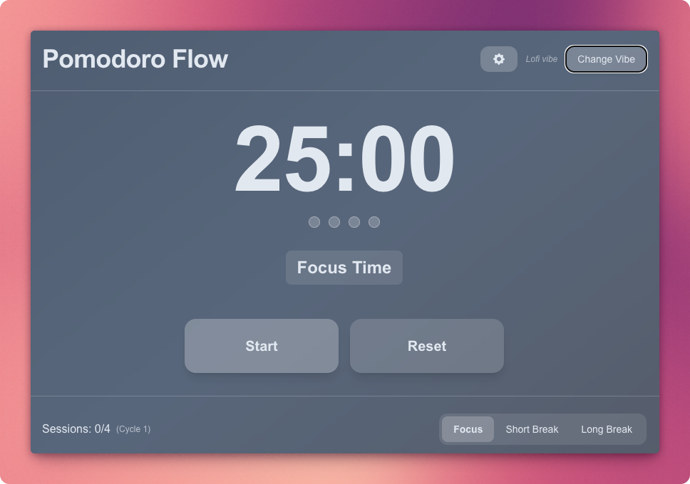
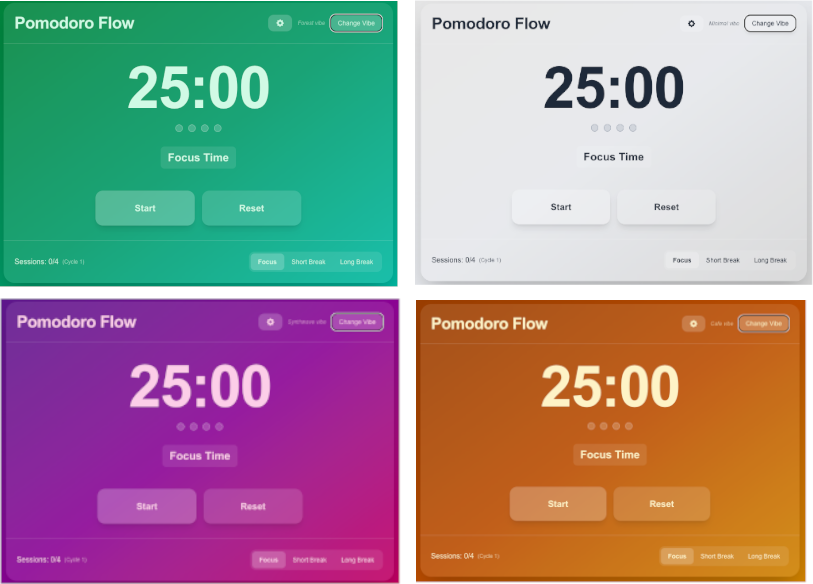
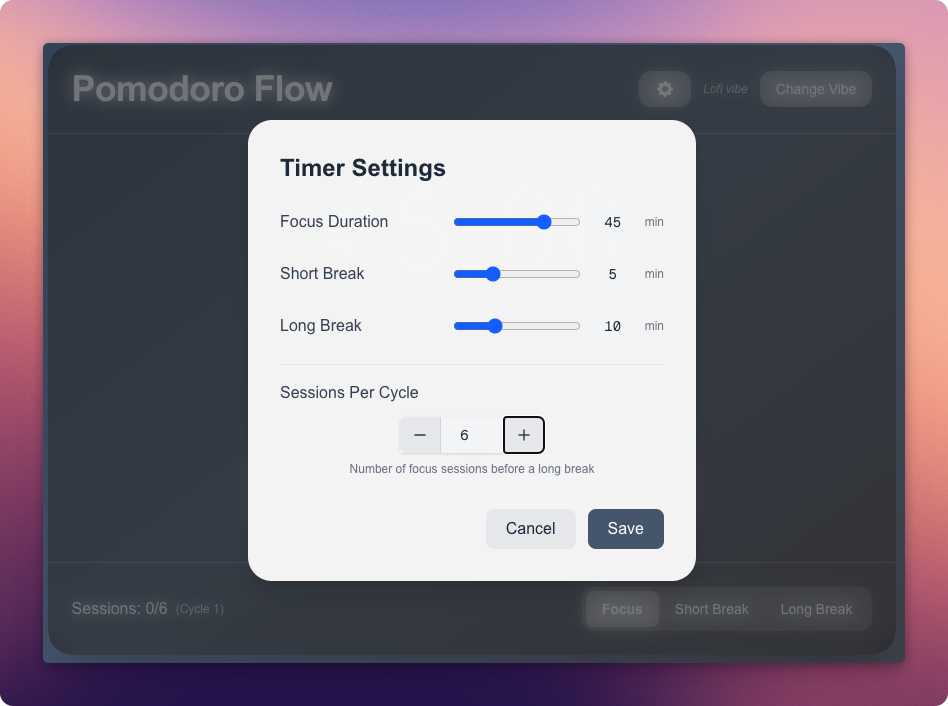

+++
title = "Vibe coding a Pomodoro app with AI"
description = "How I built a personal pomodoro app with vibe coding"
date = "2025-03-15T15:18:12-07:00"
draft = false
tags = ["AI", "LLM", "coding-assistants"]
topics = ["tech-explorations"]
+++

Today I tried something fun - I built a Pomodoro timer app mostly by talking to AI instead of typing code myself. I have done it a few times before, but this is the first time I am using to build a full app. And guess what - there is a term for it - [vibe coding](https://en.wikipedia.org/wiki/Vibe_coding), coined by Andrej Karpathy 😎. I wanted to create something to experiment with this workflow, but also worked well and felt good to use. Here's how it went!

## How I Built It
Instead of typing code, I mostly just talked to an LLM - in this case Claude Sonnet 3.7 through GitHub Copilot in Visual Studio Code. I used the macOS built-in Narrator app that I have configured as a double-press on the Fn key. It pops up quickly and I'd describe what I wanted, and the LLM would write the code. 

After each change, I'd check if it worked and looked good. I'd review the code to see if it did what I asked correctly. If I needed changes, I'd just tell the LLM what to fix - no typing needed. It felt a bit like having a super-fast coding buddy who does all the typing for you while you focus on the big picture.

Using this approach, I built a Pomodoro timer with these features:
- Focus, short break, and long break modes
- Several color themes (I kept asking for new ones until I found ones I liked)
- A notification system when timers finish
- Options to customize timer durations
- Options to customize the number of sessions per cycle
- A debug mode for testing with shorter times

All of this happened through conversation rather than me writing code directly. I could just sit back, think about what I wanted, and ask for it.

This is a key point: the conversation being integrated into the IDE makes a huge difference. I've been using Copilot for many months, but the seamless combination of voice input, code generation, and access to the full context of all source files created an experience that felt different - almost magical. This integration is what makes vibe coding truly work.

## What Worked Well

**It was super easy** - I could just sit back and talk. The default macOS Dictation app worked just fine, and while I could have used a more advanced tool like MacWhisper, the built-in option served the purpose well.

**Saved tons of time** - Features that would normally take hours happened in minutes. For example, implementing a new theme with animations would typically take me an hour of CSS work, but happened in about 5 minutes with voice commands.

**Got me 80% there** - I still had to set up the initial project structure and handle deployment myself, which is super easy with platforms like Netlify and Vercel. The AI handled the complex React components and state management, while I focused on project setup and configuration.

**Made experimenting painless** - I could try different themes, layouts, features without worrying about wasting code. This made me much more willing to experiment and try creative approaches I might have skipped otherwise.

**The LLM was clear** - It would tell me what it planned to do, then show me what it did. This made the back-and-forth smooth.

**The LLM understood context** - It could see all my files and make changes that worked together, maintaining consistency across the codebase.

## What Could Be Better

**It was slower** than typing for things I already know well. Many times, my instinct was to type, but then I would switch to voice to stay consistent with the experiment.

**Claude worked better than GPT-4o** for this project. GPT-4o sometimes said it would do something but then didn't. When I asked it to make the UI more fun, it thought for a while but didn't change anything. Claude gave much better results and followed through on requests more consistently.

**Not sufficient for serious products** - This approach works for personal projects or prototypes, but shipping to real customers would need more work on error handling, accessibility, and testing. The AI gets you a big head start but doesn't handle these production concerns well yet.

**Occasional glitches** - Sometimes I got "Sorry, no response" errors. Probably just the Claude model is busy (I get overloaded errors when using Claude through web chat as well).

## Other Thoughts
The output from Claude web chat was pretty similar to what I've seen from GitHub Copilot. I wondered if there would be big differences between AI tools, but they seemed fairly similar.

This really feels like the golden age of personal apps. You can make exactly what you want without a huge team or budget.
You do need to be comfortable "letting go" - asking the AI to be creative and then reviewing what it comes up with, rather than controlling every detail yourself.

## What This Means for Developers
I think this changes how we'll build software. The AI gets you most of the way there, but it won't handle everything just yet.

Vibe coding gives you a good starting point - in fact, it will take you almost 70-80% there. But a product or application is much more than just UI and plumbing. There's architecture, systems thinking, and understanding how different components interact. Developers still need to understand these aspects deeply. Without this knowledge, apps built purely through AI prompting will likely be sub-optimal, slow, and hard to maintain.

As developers, we'll need to be good at:

1. **Giving clear instructions** - Explaining what you want and checking if the code does it right
2. **Reading code** - Understanding what the AI wrote
3. **Thinking about the big picture** - Understanding how all the pieces fit together
4. **Designing good experiences** - As coding gets easier, making things that feel good to use becomes more important
5. **Architecture and optimization** - Ensuring the underlying structure is solid and performance is good

Designers who can learn some basic coding will really shine here. They can direct the AI to build exactly what they envision.

## Tips If You Want to Try This
Work in small steps! Ask the LLM to add one feature, check if it works, save your progress, and then move on to the next feature.

If you try to make too many changes at once, it gets messy and hard to fix things that don't work. Ironically, this brings us back to the old programming advice of making small, focused commits.

## The Final Result
My finished app, **Pomodoro Flow** is deployed at https://my-pomodoro-flow.netlify.app/. It has multiple themes and customizable settings. It's not perfect, but it's pretty good for something I built mostly by talking!

The code is open source and available on GitHub: [https://github.com/annjose/pomodoro-flow](https://github.com/annjose/pomodoro-flow)

In fact, just now, as I am writing this blog post, my app was running in the background in a browser tab and it suddenly made the 'tada' sound to say that my pomodoro session was complete. It is time for a break. So I got up and walked around for 5 min and came back to write.

The best part of this workflow is that I am focusing on what I wanted the app to do and how I wanted it to look and feel, rather than getting stuck on lower level coding details. The AI handled turning my ideas into working code.

## Wrapping Up
This isn't going to replace regular coding completely, but it's great for quickly making personal projects. Being able to just talk about your ideas and see them become real code feels like a genuine shift in how we might build software.

As AI tools get better, I think we'll see more people building this way. The question will change from "can we build this?" to "what should we build and how should it work?"

Have you tried building something with vibe coding? I'd love to hear about it!