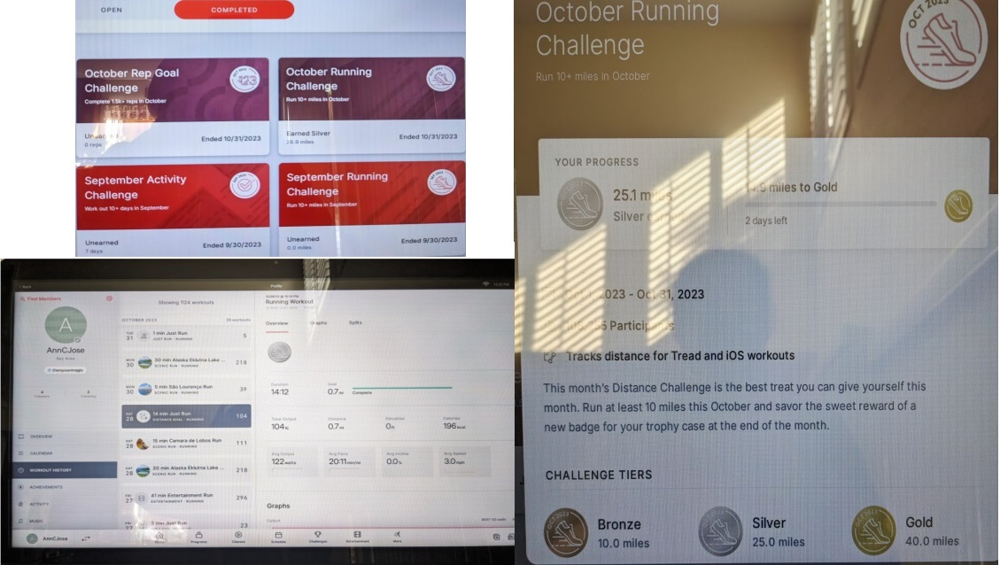

+++
title = "Week in Review - Week #3"
description = "Reimagine Week #3: (28 Oct - 03 Nov)"
date = "2023-11-03T21:32:43-07:00"
draft = false
tags = ["career", "personal-growth", "new-beginning"]
topics = []
+++

*This post has been sitting in my draft for two weeks, waiting for my time to polish and post. But then as usual, I never got to it and it just stayed there. Anyway, now I am gonna just publish. So if you see typos or mistakes, please lmk. Progress, not perfection, yeah?*

It's time to review Week #3 of my [reimagine journey](/post/new-beginning/). The previous week's reviews and the full series be found at [new-beginning tag collection](/tags/new-beginning/).

## What I was able to do this week ✅

As usual, let' review based on the goals that were set up for the week:

1. **Complete the course *Modern JavaScript* and *Typescript* - 100% this time**. I could complete only 46% of the *Modern JavaScript* course. And the TypeScript course - I have not even started. Actually, I realized that the *Modern JavaScript* course is impossible (and not designed) to complete at a fast pace. It has a huge volume of content and it follows the spaced repetition practice that allows you to do only a pre-defined portion of the content. And I want to be thorough in my learning, so I take detailed notes, do every code example, check-in the code to [my GitHub](https://github.com/annjose/learn-javascript/tree/main/execprogram-modernjs-course) and go step by step. So it will be slow and that's ok.

2. **Improve the consistency of walking 9K steps every.single.day and do 2000m rowing three days (Tue, Thu, Sat)** - I kinda sorta made progress here. Did rowing for two days (Tue and Thu), but walked every.single.day. In fact, on Tuesday, I went to my piano class and the grocery store by walking so that I will get the steps in🚶‍♀️. It was fun (and funny) to walk around with a backpack full of lessons books, onions, carrots and beans.

3. **Continue to refine *The Flow* routine - move around >= 10 min every hour** - The progress here was slow, at least I could not stay focused as much as I wanted to. I think I would have followed the FLow routine only 50% of the time. 

4. **Play the song Perfect by Ed Sheeran on the piano - both hands** - I got the right hand properly (see a video below), but I |really struggled with the left hand. I just couldn't understand the chords. I would continously play the chords until my fingers hurt, and become frustrated. Then while practicing today morning, I got it ' out of the blue! It just clicked for me ' as if my brain was resisting for many days, and woke up today with a magical skill. Now I am motivated and able to practice more and improve. Yes, small successes motivates you to do more.

5. **Read one book** - I started [reading a book](https://en.wikipedia.org/wiki/Tom_Brown%27s_School_Days), but did not finish it. Not finding the motivation to read everyday in the midst of many things. This is also strange, but more on that below.

Note: As usual, all the code examples and exercises done this week are shared in my github repo https://github.com/annjose/learn-javascript/tree/main/execprogram-modernjs-course.

## Other things done ☑️

This week, I completed the **Peloton October Running Challenge** with **Silver Tier** covering 25 miles in a month. 

Btw, the challenge is named "running", but I absolutely did not run, I just walked on the treadmill at a speed of 3.2 mph. I know, I know this is low intensity, but 45-60 min is good exercise. Plus, I get to watch Netflix/HBO while on the treadmill. Also, I reached this Sliver tier after a long time, almost 14 months since I did it last. So overall, I am happy.

Here is a picture of the challenge and the activity.

 

This one may sound crazy (and may also be one of the reasons why I didn't get the time to read) - I started taking [Spanish lessons in Duolingo](https://www.duolingo.com/enroll/es/en/Learn-Spanish). With the strong history and connection with my state of California, I was always curious to know more about this language and learn if possible. 

But what really triggered me to take action was a recent TED talk [How to make learning as addictive as social media](https://www.ted.com/talks/luis_von_ahn_how_to_make_learning_as_addictive_as_social_media?language=en) by Luis von Ahn. 
He made a strong case than we can (and should) use the techniques and strategies used by social media companies to grab our attention to the field of learning and education. And that is exactly what he and his co-founder did in Duolingo.

As I am doing the course, I am seeing it in action in the product. It has just the right amount of gamification, healthy competition and nudges to maintain your streak. Yes, indeed it is addicitive, but is for a good cause to learn this language.

## What I learned this week 🍀

* **Wearing workout sneakers at home** gives you constant reminder that you need to walk around and reach the 9K steps by end of the day. I tried it a couple of days and it really helped me, so I will continue this practice.

* I love, love, **love that I am coding everyday**, even though they are simple exercises and projects. When I am at the keyboard, I am in the flow.

* In Hugo, you can **embed a video in any page/post** using a Hugo shortcode https://github.com/martignoni/hugo-video. The only nuance is that the page has to be in a bundle, i.e. a folder like `post-01/index.md`, and not a page file `post-01.md`. This was pretty cool - I thought we could embed only images. The more I learn about Hugo, the more I love it.

* In the spirit of sharing progress, here is a video of me playing the Perfect song on my piano. This was recorded on 29 Oct to get feedback from my teacher. 

As you can see, it is nowhere close to the real song, in fact, you may not even recognize the song as you know it. Sorry🥺! But, you know, this is my progress at the time and I am happy to share it with you. Also,his is my first and best performance on the piano in my entire life. Progress over perfection, right? 



## Looking Ahead to Next Week ⏭️

#### Primary goals for next week (Week #4)
  1. Complete 60% of the course *Modern JavaScript*
  2. Improve the consistency of walking 9K steps every.single.day and do 2000m rowing three days (Tue, Thu, Sat) 💪
  3. [OpenAI Dev Day](https://devday.openai.com/) on Nov 6th! Excited to see what's coming!
  4. Play the song Perfect by Ed Sheeran on the piano - both hands 🎵🎹
  5. Read three pages every day (average) 📚

Overall, Week 3 was OK, although I get a wind of difficult to stay motivated and focused. Will see how it goes the coming well. Until then, Adios👋!